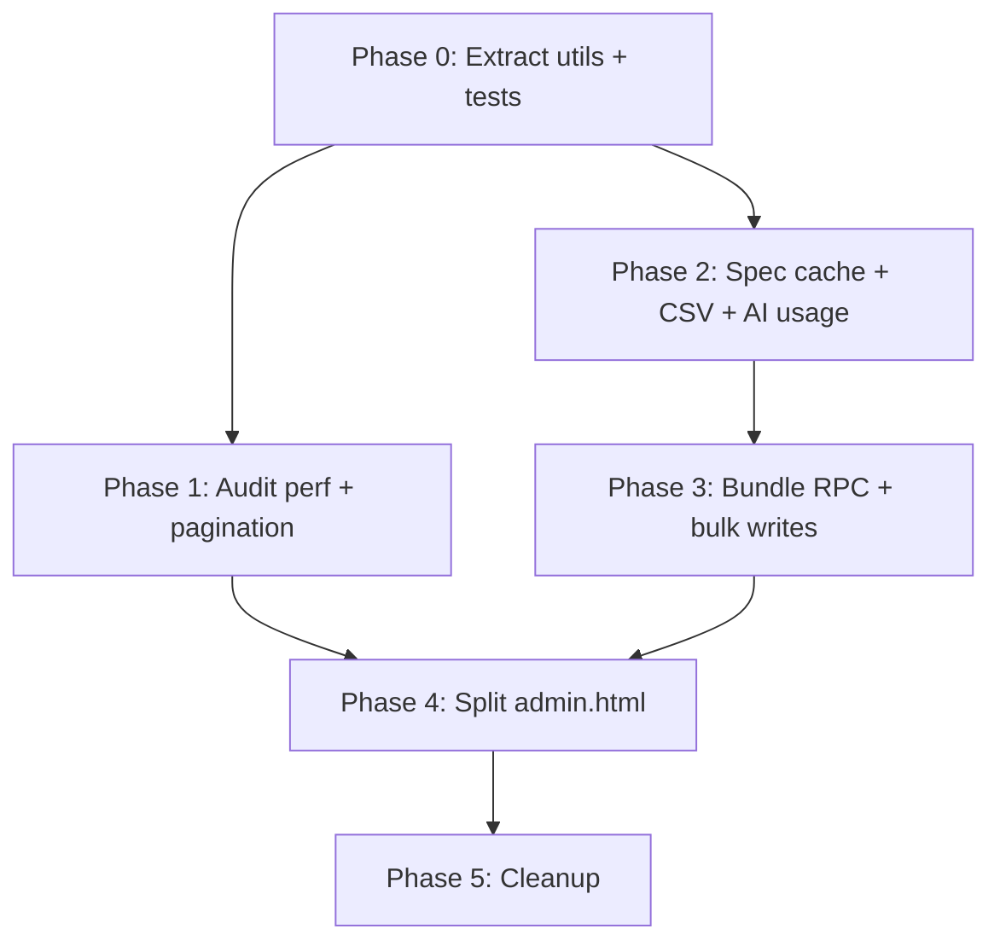

# Admin Efficiency Implementation Plan

Implementation plan derived from the admin code review (August 2026). Focus: performance, correctness, maintainability, and safer writes for the developer question-bank portal (`admin.html` and related `src/` modules).

**Scope:** Admin portal only (`admin.html`, `src/admin*.js`, `src/csvQuestionImport.js`, related Supabase migrations/RPCs). Student app (`src/app.js`) refactors are out of scope unless noted as follow-up.

**Out of scope for this plan:** Product/feature changes, UI redesign, changes to RLS policy semantics.

---

## Goals

| Goal | Success metric |
|------|----------------|
| Faster audit queries | Audit load for a full subject/paper completes in under 3s on a bank of 2,000+ questions (vs. loading entire `mark_points` today) |
| Correct audit results | No silent PostgREST 1,000-row truncation on question queries |
| Safer writes | Question create/edit/batch commit is all-or-nothing per record (no orphan `questions` without `answer_keys`) |
| Faster bulk operations | CSV import of 50 rows completes with fewer than 60 HTTP round trips (vs. ~150–250 today) |
| Maintainable codebase | `admin.html` reduced to shell markup + imports; logic lives in testable modules |

---

## Current state (baseline)

| Area | Location | Issue |
|------|----------|-------|
| Monolith | `admin.html` (~12,900 lines) | HTML + ~1,900 lines CSS + ~8,700 lines inline JS |
| Audit mark points | `admin.html` `btnQueryQuestions` handler | `fetchAllRows` on entire `mark_points` table every query |
| Audit questions | `runAuditQuestionQuery()` | No pagination; 1,000-row PostgREST cap |
| Spec point loaders | 5 near-duplicate functions | Re-fetch same `(subject, paper, course_track)` per tab |
| Writes | Creator, edit, batch, CSV | 4–6 sequential HTTP calls per question; no transaction |
| Skills | `src/adminSkills.js` | Client delete+insert; ignores `sync_question_skills` RPC |
| Bulk edit | `btnApplyBulkEdit` | Sequential per-question updates |
| Legacy | `src/admin.js` | Orphaned; not imported by `admin.html` |

**Existing assets to reuse:**
- `fetchAllRows()` and `chunkArray()` in `src/dbClient.js`
- `sync_question_skills` RPC (`supabase/migrations/20250623_sync_question_skills_rpc.sql`)
- `record_question_ingestion` RPC
- Tests in `tests/` for CSV import, generators, `adminSkills`, `aiQuestionDraft`

---

## Phase 0 — Preparation (no user-visible changes)

**Objective:** Safe refactoring foundation before behavioural changes.

### 0.1 Baseline measurements

Record before/after numbers for:
- Audit query time (Physics Paper 1, all types, combined track)
- Audit query row count vs. expected count from SQL `count(*)`
- CSV import time for 20-row TSV
- Batch numeric commit time for 10 questions
- `admin.html` transfer size (DevTools Network)

**Deliverable:** Short baseline section appended to this doc or a `docs/admin-baseline.md` note.

### 0.2 Extract shared admin utilities (no behaviour change)

Create modules under `src/admin/` (or `src/admin/` flat files):

| Module | Responsibility |
|--------|----------------|
| `adminSpecLink.js` | `lookupEquivalence`, `resolveSpecIdsForCommit`, `formatSpecPointLabel`, `autoFillLinkedSpec`, `syncSpecLinkUi` — parameterised by mode (`creator` \| `edit` \| `batch` \| `batchMcq` \| `chemQuant`) |
| `adminSpecCache.js` | In-memory cache keyed by `subject\|paper\|courseTrack`; `loadSpecPoints()`, `getSpecPointById()`, `resolveSpecRef()` |
| `adminImageUpload.js` | Shared `uploadQuestionImage(file, subject)` → public URL |
| `adminDom.js` | `escapeHtml`, toast helpers if not already shared |

Wire `admin.html` to import these; delete duplicated inline copies only after parity tests pass.

**Acceptance criteria:**
- All existing `node --test` suites pass
- Manual smoke: create question, edit question, batch preview+commit (1 question), CSV import (1 row), audit query — unchanged behaviour

### 0.3 Add admin-focused tests (characterisation)

| Test file | Covers |
|-----------|--------|
| `tests/adminSpecLink.test.js` | Equivalence resolution, triple-only vs both audience |
| `tests/adminSpecCache.test.js` | Cache hit/miss, spec_ref lookup |
| `tests/adminAuditQuery.test.js` | Pure functions: `dedupeQuestionsById`, `getAuditQuestionSpecRef`, filter helpers (extract from `admin.html` during Phase 1) |

**Acceptance criteria:** New tests green before Phase 1 query changes land.

---

## Phase 1 — Audit panel performance & correctness (P0)

**Objective:** Fix the two highest-impact audit issues without changing audit UX.

### 1.1 Paginate audit question queries

**Change:** Refactor `runAuditQuestionQuery()` to use `fetchAllRows()` from `dbClient.js`.

**Additional:** When `combinedIds` or `tripleIds` arrays are large, chunk `.in("spec_point_id", chunk)` using `SPEC_ID_CHUNK_SIZE` (80) — same pattern as `fetchQuestionsLinkedToSpecPoints()`.

**Files:** Extract query logic to `src/admin/adminAuditQuery.js`; update `admin.html` import.

**Acceptance criteria:**
- Subject/paper with >1,000 questions returns full count (verify with SQL count)
- Existing audit filters (type, search, topic, spec ref, metadata, remediation) still work
- Unit tests for chunk merge + dedupe

### 1.2 Scope mark-point stats to audit results

**Current:** Loads all `mark_points` via `fetchAllRows` on every audit query.

**Target flow:**
1. Fetch filtered questions (Phase 1.1)
2. Collect question IDs from result set
3. Fetch mark points only for those IDs (chunked `.in("question_id", ids)` + `fetchAllRows` per chunk if needed)
4. Build `auditMarkPointStatsMap` from scoped result

**Optional fast path (Phase 1.2b — if still slow):** Postgres RPC `developer_mark_point_stats(p_question_ids uuid[])` returning `(question_id, gradable, missing_feedback)`.

**Acceptance criteria:**
- Network tab shows mark_points request filtered by question IDs, not full table scan
- Warning badges (keyword fallback, checkpoint gap) unchanged for sample questions
- Audit query time improves measurably vs. Phase 0 baseline

### 1.3 Remove redundant skills fetch

**Change:** After nested `question_skills(...)` join in audit select:
- Only call `attachSkillsToQuestions()` when any row has empty/missing nested skills **or** when fallback select (without join) was used

**Files:** `src/adminSkills.js`, audit query module

**Acceptance criteria:**
- Skills badge and “Gap” metadata unchanged on questions with tagged skills
- One fewer round trip on typical audit queries

### 1.4 Audit UI quick wins (same phase, low risk)

| Change | Benefit |
|--------|---------|
| Event delegation on `#auditList` for Edit/Test/Copy/Del (remove inline `onclick`) | Sort/re-render does not rely on string-built handlers |
| Move repeated inline row styles to CSS classes | Smaller HTML strings, faster render |

**Defer:** Virtual scrolling → Phase 4 (needs more refactor)

**Acceptance criteria:** Sort, select-all, bulk bar, row actions work as before

---

## Phase 2 — Shared caching & import efficiency (P1)

**Objective:** Eliminate redundant spec-point fetches and speed CSV import.

### 2.1 Spec point cache across tabs

**Change:** Replace five `load*SpecPointSelect` implementations with:

```text
adminSpecCache.loadSpecPoints({ subject, paper, courseTrack })
  → populates cache + returns rows for <select> rendering
```

Invalidate cache when `(subject, paper, courseTrack)` changes. Preload equivalences table once per session (small table) into a `Map<combinedId, tripleId>`.

**Files:** `src/admin/adminSpecCache.js`, all tab loaders in `admin.html` (or extracted tab modules)

**Acceptance criteria:**
- Switching Creator → Batch Numeric → back to Creator with same filters: one spec_points network request
- Linked spec auto-fill still works for combined/triple/both audience

### 2.2 CSV import batch resolution

**Change:** Before row loop in CSV handler:
1. Load spec points for import `(subject, paper)` into cache
2. Load equivalences map
3. Per row: resolve `spec_ref` from cache (0 extra queries for spec lookup)

**Optional:** Parallel commit with concurrency limit (e.g. 3) if Phase 3 RPC not yet available.

**Files:** `admin.html` CSV section → `src/admin/adminCsvImport.js`

**Acceptance criteria:**
- 20-row import: ≤25 HTTP calls without bundle RPC (down from ~60+)
- Existing `tests/csvQuestionImport.test.js` pass
- Import error messages unchanged for bad spec_ref

### 2.3 AI usage monitor fetch optimisation

**Change:**
- Fetch raw `ai_usage_events` only when view mode is `"raw"`
- Apply `fetchAllRows()` for raw mode date ranges
- Grouped mode: RPC summary only (+ profile names from summary rows)

**Acceptance criteria:**
- Grouped view: no full events table download
- Raw view: complete event list beyond 1,000 rows
- Token totals match summary RPC for same date range

---

## Phase 3 — Transactional & bulk writes (P1)

**Objective:** Atomic question bundles; faster batch/CSV/bulk edit commits.

### 3.1 New RPC: `developer_upsert_question_bundle`

**Migration:** `supabase/migrations/YYYYMMDD_developer_upsert_question_bundle.sql`

**Input (jsonb):** question row, answer_key, mark_points[], skill_ids[], optional provenance payload

**Behaviour:**
- `is_developer()` guard
- Single transaction: upsert question → upsert answer_key → replace mark_points → call `sync_question_skills` → optional `record_question_ingestion`
- Return `{ ok, question_id, error? }`

**Client:** New `src/admin/adminQuestionCommit.js` with `commitQuestionBundle(supabase, bundle)`

**Rollout:** Wire creator save first; then edit save; then batch/CSV one at a time.

**Acceptance criteria:**
- Forced failure mid-bundle (test hook): no orphan question row
- Creator + edit manual smoke tests pass
- RLS unchanged for non-developers

### 3.2 Use `sync_question_skills` RPC in client

**Change:** Replace `saveQuestionSkills()` delete+insert with:

```javascript
await supabaseClient.rpc('sync_question_skills', {
  p_question_id: questionId,
  p_skill_ids: skillIds
});
```

Cache `assertDeveloperForSkillSave()` result for session (invalidate on sign-out).

**Files:** `src/adminSkills.js`

**Acceptance criteria:**
- `tests/mergeSkillCodes.test.js` pass
- Skill save still blocked for non-developer (manual test with teacher account)

### 3.3 Bulk edit batching

**Change:**
- Shared-field updates: single `.update(patch).in('id', ids)` when all selected questions get identical patch
- Skills: loop remains unless bulk RPC added later; at minimum use `sync_question_skills` (one call per question, not two)
- Re-run audit once at end (already done)

**Future (optional):** `developer_bulk_update_questions(jsonb)` RPC

**Acceptance criteria:**
- Bulk tier/demand update on 20 questions: ≤25 HTTP calls
- Per-question demand adjustment when tier changes still correct

### 3.4 Batch commit paths

Wire batch numeric, chem quant, and MCQ commit loops to `commitQuestionBundle()` instead of separate inserts.

**Acceptance criteria:**
- 10-question batch commit: ~10 RPC calls (or 1 bulk RPC if implemented)
- Generation logs still written

---

## Phase 4 — Modularise `admin.html` (P2)

**Objective:** Maintainability and enable virtual scrolling.

### 4.1 File split

| File | Contents |
|------|----------|
| `admin.html` | Shell, tab panels markup, script type=module entry |
| `admin.css` | Styles currently in `<style>` block (~lines 26–1947) |
| `src/admin/adminEntry.js` | Auth gate, tab switching, module init |
| `src/admin/adminCreator.js` | Create question panel |
| `src/admin/adminEditModal.js` | Edit/copy modal |
| `src/admin/adminAudit.js` | Audit panel (query, render, bulk bar) |
| `src/admin/adminBatchNumeric.js` | Batch numeric tab |
| `src/admin/adminBatchChem.js` | Chem quant tab |
| `src/admin/adminBatchMcq.js` | AI studio / MCQ tab |
| `src/admin/adminCsvPanel.js` | CSV importer |
| `src/admin/adminAiUsage.js` | AI usage monitor |
| `src/admin/adminPilot.js` | Pilot Pro panel |

Remove `window.*` exports except where required for inline HTML during transition; prefer module imports.

### 4.2 Minimal build tooling (optional but recommended)

Add `package.json` with:
- `vite` or `esbuild` for dev server + production bundle
- Script: `"test": "node --test tests/**/*.test.js"`

Keep deployment compatible with static hosting (build outputs to `dist/` or bundle single `admin.bundle.js`).

**Acceptance criteria:**
- `admin.html` under 500 lines markup
- All admin tabs functional after split
- No regression in test suite

### 4.3 Audit virtual scrolling

**After 4.1:** Implement windowed rendering in `adminAudit.js` (e.g. render 50 rows + buffer; update on scroll).

**Acceptance criteria:**
- 500+ question audit result: scroll stays responsive
- Sort re-render acceptable (<500ms)

---

## Phase 5 — Cleanup & follow-up (P3)

### 5.1 Remove legacy code

- Delete or archive `src/admin.js` (document in CHANGELOG if external docs reference it)
- Remove duplicate `parseCSVToObjects` if fully superseded

### 5.2 Documentation

- Update `README.md` admin section: module map, how to run tests, env vars
- Add `docs/admin-architecture.md` with data-flow diagram (audit query, commit bundle)

### 5.3 Follow-up (separate initiative)

- Apply similar modularisation to `src/app.js` (~5,500 lines)
- CI workflow running `node --test`
- Env-based Supabase URL/key injection at build time

---

## Dependency graph



**Recommended execution order:** 0 → 1 → 2 → 3 → 4 → 5

Phases 1 and 2 can partially overlap after 0.1 completes. Phase 3 should follow Phase 2 CSV cache work. Phase 4 is easier after Phases 1–3 stabilise query/commit APIs.

---

## Risk register

| Risk | Mitigation |
|------|------------|
| Bundle RPC migration breaks existing saves | Ship creator path first; feature flag or fallback to legacy sequential saves for one release |
| Chunked `.in()` queries hit URL limits | Use `SPEC_ID_CHUNK_SIZE` (80); add tests with large ID lists |
| Refactor introduces audit filter bugs | Characterisation tests before moving functions; compare row counts to SQL |
| Virtual scrolling breaks selection/bulk edit | Keep selection state in `Set` outside DOM; test select-all across virtual window |
| Developer-only RPC security | Reuse `is_developer()` in all new functions; security definer + `search_path = public` |

---

## Testing strategy

| Layer | What |
|-------|------|
| Unit | Pure helpers: spec link, cache, audit filters, dedupe, sort |
| Integration | CSV parse → bundle shape; `commitQuestionBundle` mock supabase |
| Manual (developer) | Full tab smoke after each phase |
| SQL verification | Row counts for >1,000 question subject; orphan check after failed commit |

**Manual checklist (run after Phases 1, 3, 4):**
- [ ] Sign in as developer; teacher redirected away
- [ ] Audit query Physics P1; sort by severity; bulk edit tier on 3 questions
- [ ] Create MCQ + short_text + numeric; edit each; copy question
- [ ] Batch numeric preview + commit 5 questions
- [ ] CSV import 5 rows
- [ ] AI usage grouped + raw views for last 7 days
- [ ] Pilot Pro grant/revoke (if used)

---

## Task checklist (trackable)

### Phase 0
- [ ] Record performance baseline
- [ ] Create `src/admin/adminSpecLink.js`
- [ ] Create `src/admin/adminSpecCache.js`
- [ ] Create `src/admin/adminImageUpload.js`
- [ ] Add characterisation tests
- [ ] Smoke test parity

### Phase 1
- [ ] Extract `adminAuditQuery.js`
- [ ] Paginate question queries + chunk spec IDs
- [ ] Scope mark_points fetch to result IDs
- [ ] Conditional `attachSkillsToQuestions`
- [ ] Audit event delegation + CSS class cleanup

### Phase 2
- [ ] Wire spec cache to all tab loaders
- [ ] Preload equivalences map
- [ ] CSV import cache-first resolution
- [ ] AI usage conditional raw fetch + pagination

### Phase 3
- [ ] Migration: `developer_upsert_question_bundle`
- [ ] `adminQuestionCommit.js` client wrapper
- [ ] Wire creator + edit saves
- [ ] Switch `saveQuestionSkills` to RPC + session cache
- [ ] Optimise bulk edit updates
- [ ] Wire batch commit loops to bundle RPC

### Phase 4
- [ ] Extract `admin.css`
- [ ] Split panel modules
- [ ] Optional Vite/esbuild setup
- [ ] Audit virtual scrolling

### Phase 5
- [ ] Remove `src/admin.js`
- [ ] Update README / architecture docs

---

## Estimated effort (engineering complexity, not calendar time)

| Phase | Complexity | Notes |
|-------|------------|-------|
| 0 | Low–medium | Mostly moves; low risk if tests added first |
| 1 | Medium | Highest user-visible perf win |
| 2 | Medium | CSV + cache; touches many tab loaders |
| 3 | High | SQL RPC design + client migration; needs careful transaction testing |
| 4 | High | Large file split; schedule after API stabilises |
| 5 | Low | Cleanup |

---

## Definition of done (whole initiative)

1. Audit queries are paginated and do not load the full `mark_points` table.
2. Question create/edit/batch/CSV use transactional bundle commit (or documented fallback removed).
3. `admin.html` is a thin shell; admin logic lives in `src/admin/*` with tests.
4. Baseline metrics show measurable improvement on audit query and CSV import.
5. No open P0/P1 items from the original review remain.

---

*Generated from admin code review. Save location: project root per workspace rules.*
