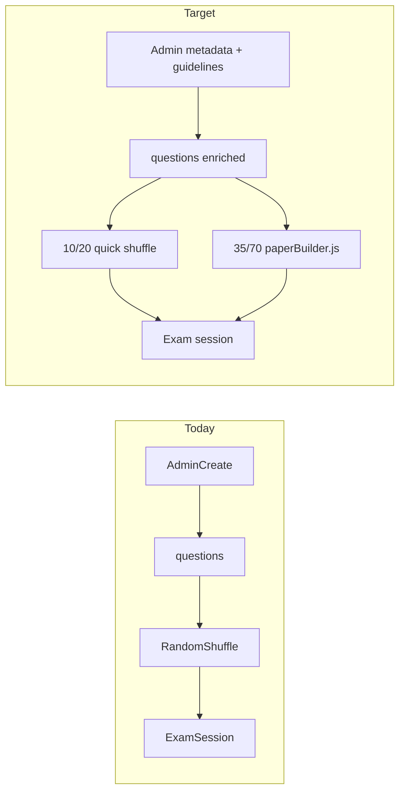

# AQA-Aligned Exam Prep and Admin Metadata Plan

## Current state

- **No exam-metadata on questions** beyond `tier`, `question_type`, and `max_marks`. AO is inferred at marking time from [`mark_points`](src/dbClient.js) or type heuristics in [`evalEngine.js`](src/evalEngine.js) / [`app.js`](src/app.js) — not suitable for reliable paper assembly.
- **Exam prep** ([`sessionEngine.startAnyPractice`](src/sessionEngine.js)) shuffles the filtered pool and takes N questions; no AO, demand, maths, or RP logic.
- **Command words** exist only as student-facing tips via [`getAQACommandWordHelper`](src/evalEngine.js) (parsed from prompt first word) — not stored or used for selection.
- **Legacy hint**: [`src/admin.js`](src/admin.js) RPC import passes `p_difficulty`, suggesting Supabase may already have an unused `difficulty` column — verify in Supabase before adding new columns (repurpose vs replace).



---

## Phase 1: Supabase schema (questions + optional spec_points)

Add columns on **`questions`** (authoritative for selection):

| Column | Type | Purpose |
|--------|------|---------|
| `command_word` | `text` nullable | e.g. `state`, `explain`, `calculate` — admin-selected, auto-suggested from prompt |
| `demand_level` | `text` not null | FT: `low`, `standard`. HT: `standard_45`, `standard_67`, `high_89` |
| `ao1_marks` | `smallint` | Marks counting toward AO1 (sum with ao2/ao3 should equal `max_marks`) |
| `ao2_marks` | `smallint` | |
| `ao3_marks` | `smallint` | |
| `is_maths_skill` | `boolean` default false | Counts toward subject maths-skills minimum |
| `is_required_practical` | `boolean` default false | Counts toward 15% RP minimum |

**Validation rule (DB check or app-level):** `ao1_marks + ao2_marks + ao3_marks = max_marks`.

**Optional on `spec_points`:** `is_required_practical_topic boolean` — used only as admin default when creating questions linked to RP spec statements (not for selection directly).

**Migration / backfill strategy:**
1. Add nullable columns first.
2. Backfill script (Supabase SQL or one-off admin job):
   - AO marks from existing `mark_points` sums per AO; fallback to current heuristics (mcq→AO1, numeric→AO2, extended→split thirds).
   - `is_maths_skill`: `question_type = 'numeric'` OR prompt starts with `calculate`/`determine`.
   - `demand_level`: infer from `command_word` mapping (below) + `tier`.
   - `is_required_practical`: manual review pass initially; flag questions whose spec_ref matches known RP list if you maintain one.
3. Enforce NOT NULL on `demand_level` once backfill complete.

Update **`bulk_import_full_question`** RPC (used by [`src/admin.js`](src/admin.js)) to accept the new fields.

---

## Phase 2: Shared exam rules module

New file: **`src/examRules.js`** — single source of truth for AQA Trilogy constraints and admin guideline text.

**Target weightings (per paper, mark-based):**

| Constraint | Foundation | Higher |
|------------|------------|--------|
| AO1 / AO2 / AO3 | 40% / 40% / 20% | same |
| Demand | 60% low, 40% standard | 40% `standard_45`, 40% `standard_67`, 20% `high_89` |
| Maths skills (min) | Bio 10%, Chem 20%, Phys 30% | same (by filtered subject) |
| Required practicals (min) | 15% of marks | same |

**Command word → suggested demand** (admin guideline defaults, overridable):

- **Low demand (FT):** `state`, `give`, `name`, `define`, `identify`, `write`, `plot`, `label`
- **Standard demand (FT):** `describe`, `compare`, `calculate`, `determine`, `suggest`, `use`, `show`
- **Standard 4–5 (HT):** `describe`, `compare`, `calculate` (routine)
- **Standard 6–7 (HT):** `explain`, `suggest`, `use` (applied)
- **High 8–9 (HT):** `explain` (multi-step), `evaluate`, `justify`, `discuss`, `compare` (complex), extended 6-mark stems

Export helpers:
- `suggestCommandWord(prompt)` — reuse logic from [`getAQACommandWordHelper`](src/evalEngine.js)
- `suggestDemandLevel(commandWord, tier)`
- `suggestAoMarks(questionType, maxMarks, markPoints)` — port logic from [`markResponse` maxAo block](src/evalEngine.js)
- `getPaperTargets(totalMarks, tier, subject)` — returns integer mark targets per bucket (largest-remainder rounding)
- `buildExamPaper(candidates, targets, options)` — selector (below)

---

## Phase 3: Paper builder algorithm

New file: **`src/paperBuilder.js`** — used **only** for AQA paper modes (35 / 70 marks).

**Quick modes (10 / 20 questions)** keep today's behaviour: [`startAnyPractice`](src/sessionEngine.js) shuffle + slice. No AO/demand/maths/RP constraints, no balance preview, no metadata required on the pool.

**Paper modes (35 / 70 marks)** use the builder below.

**Input:** filtered question pool (with metadata + `max_marks`), student's `tier` (FT/HT from [`tierFilter`](index.html)), `subject`, `targetMarks` (35 or 70).

**Sizing:**
- **35 / 70** — hard mark budget; fill until total marks ≥ target (trim last question if over by small margin, or swap for closer fit).

**Selection approach:** greedy + limited backtracking (keep implementation simple; pool sizes are modest):
1. Score each question by how much it helps under-filled constraints (AO marks, demand marks, maths marks, RP marks).
2. Pick highest marginal-value question; repeat until budget/count met.
3. If constraints cannot be met (common early on with sparse RP/AO3 bank), return closest match + explicit shortfall list.

**Output:** ordered question list + summary object for UI:

```js
{
  questions: [...],
  totals: { marks, ao1, ao2, ao3, demand: {...}, maths, rp },
  targets: {...},
  shortfalls: ["AO3 marks 2 below target", "Required practical marks 4 below 15%"]
}
```

Add `startExamPrep(context, { targetMarks })` in [`sessionEngine.js`](src/sessionEngine.js) for 35/70 only; 10/20 continue to call `startAnyPractice`. Fetch `mark_points` only when `ao*_marks` are null (transition period).

---

## Phase 4: Admin UI — metadata authoring + guidelines

Primary file: [`admin.html`](admin.html) (creator + edit modal + audit table).

### Section 1 additions (Question Core)

Add fields below existing tier/type controls:

1. **Command word** — dropdown + "Detect from prompt" button calling `suggestCommandWord`
2. **Demand level** — tier-aware dropdown (FT shows low/standard; HT shows three bands); auto-filled from command word + tier with override
3. **AO mark allocation** — three numeric inputs (`ao1_marks`, `ao2_marks`, `ao3_marks`) with live validation against `max_marks`; "Auto from mark points" button
4. **Flags** — checkboxes: `is_maths_skill`, `is_required_practical`

### Collapsible "AQA Authoring Guidelines" panel (static copy from `examRules.js`)

Include:
- AO 40/40/20 explanation and examples per question type
- FT vs HT demand band definitions (your grade 4–5 / 6–7 / 8–9 framing)
- Command-word → demand table (editable reference, not config)
- Maths skills minimums by subject
- Required practicals 15% note
- Reminder: Section 3 mark points should align with AO mark fields

### Validation on commit ([`btnCommit`](admin.html) + edit save)

- Block save if AO marks ≠ `max_marks`
- Warn (non-blocking) if demand conflicts with command-word suggestion
- Warn if neither maths nor RP flagged on a numeric/RP-style prompt

### Audit table enhancements

Show columns: command word, demand, AO split, maths, RP — filterable; badge for incomplete metadata.

### CSV / bulk import

- Extend [`admin.html` CSV importer](admin.html) columns and [`src/admin.js`](src/admin.js) RPC payload with new fields.
- Document column layout in guidelines panel.

---

## Phase 5: Student exam prep UI

Files: [`index.html`](index.html), [`src/app.js`](src/app.js), [`styles.css`](styles.css)

**Replace exam prep dropdown with two labelled groups:**

| Option | Label | Behaviour |
|--------|-------|-----------|
| 10 | Quick — 10 questions | Random shuffle from filtered pool (current `startAnyPractice`) |
| 20 | Quick — 20 questions | Same as today, no AQA constraints |
| 35 | Half paper — 35 marks | `startExamPrep` + `paperBuilder` with full AQA balance |
| 70 | Full paper — 70 marks | Same balanced assembly |

No "AQA paper balance" toggle — mode is implicit from the selection. Quick options never invoke the builder.

**Pre-start preview** (inline under controls, **35/70 only**): show achieved vs target marks for AO, demand, maths, RP; list shortfalls if any. Hidden or omitted for quick modes.

**[`btnExamPrep` handler](src/app.js):** branch on selection — `≤20` → `startAnyPractice`; `35` or `70` → `startExamPrep`.

**Session summary** ([`showSessionSummary`](src/app.js)): AO/demand breakdown for completed **paper-mode** sets only (reuse AO stats pattern from analytics).

---

## Phase 6: Refactor AO analytics to use canonical metadata

Update [`loadTopics` AO mastery block](src/app.js) (~lines 1589–1634) to prefer `questions.ao*_marks` when present, falling back to mark_points/heuristics. Keeps dashboard consistent with exam prep tagging.

---

## Implementation order

1. Supabase migration + backfill SQL
2. `examRules.js` + `paperBuilder.js`
3. Admin creator/edit/audit + validation
4. Exam prep UI + `startExamPrep` integration
5. Analytics alignment + CSV/RPC import
6. Content authoring pass (tag existing bank; expect shortfalls until RP/AO3 coverage improves)

---

## Risks and mitigations

| Risk | Mitigation |
|------|------------|
| Sparse RP / AO3 / high-demand questions in bank | Shortfall reporting; admin audit filters for gaps |
| Quick vs paper modes confuse users | Group dropdown optgroups: "Quick practice" vs "AQA paper simulation"; paper modes show balance preview |
| AO marks drift from mark_points | "Sync from mark points" button; validation on save |
| `tier` on question (`foundation`/`higher`/`both`) vs student FT/HT | Selector already filters `tier IN (FT tiers, both)` — unchanged; demand_level is separate from access tier |

---

## Files to touch (summary)

- **New:** `src/examRules.js`, `src/paperBuilder.js`, Supabase migration SQL (repo doc or `supabase/migrations/` if you add that folder)
- **Core:** [`src/sessionEngine.js`](src/sessionEngine.js), [`src/app.js`](src/app.js), [`src/dbClient.js`](src/dbClient.js)
- **Admin:** [`admin.html`](admin.html), [`src/admin.js`](src/admin.js)
- **UI:** [`index.html`](index.html), [`styles.css`](styles.css)
- **Optional align:** [`src/evalEngine.js`](src/evalEngine.js) (export command-word parser for reuse)

No student-facing changes to marking logic required — metadata is for assembly and analytics; existing [`markResponse`](src/evalEngine.js) remains authoritative at grade time.
