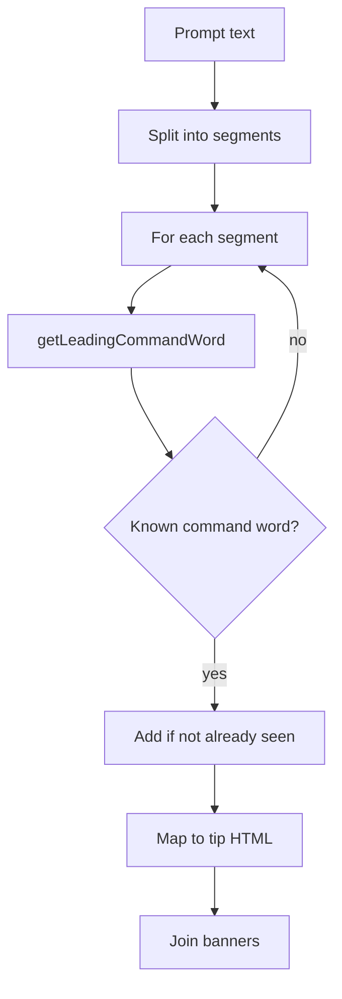

# Command word tips for any sentence start

## Current behaviour

[`getAQACommandWordHelper`](src/evalEngine.js) only inspects the **first word of the entire prompt**:

```107:109:src/evalEngine.js
export function getAQACommandWordHelper(promptText) {
  const words = promptText.toLowerCase().trim().split(/\s+/);
  const firstWord = words[0]?.replace(/[.,\/#!$%\^&\*;:{}=\-_`~()?]/g, "");
```

The result is passed unchanged from [`loadQuestion`](src/app.js) into [`renderQuestionLayout`](src/uiComponents.js), which injects the HTML banner below the prompt. No UI changes are required.

**Gap example:** `"A student measures the temperature. Explain why the rate increases."` — no tip is shown because the first word is `"A"`, not `"explain"`.

## Target behaviour

- Split the prompt into sentence-like segments.
- For each segment, detect whether a recognised command word leads that segment.
- Return **one tip banner per distinct command word** found, in reading order (your preference).
- Preserve all existing tip text and CSS classes (`exam-tip--describe`, etc.).

## Implementation (single file: [`src/evalEngine.js`](src/evalEngine.js))

### 1. Extract tip HTML into a small lookup helper

Refactor the existing `if (firstWord === "describe")` chain into something like `getTipHtmlForCommandWord(word)` that returns the HTML string or `""`. This avoids duplicating the tip blocks when building multiple banners.

Recognised words (unchanged): `describe`, `explain`, `evaluate`, `calculate`, `compare`, `state`, `give`, `name`, `suggest`, `discuss`, `justify`, `determine`, `define`.

### 2. Add sentence splitting

Split `promptText` on sentence boundaries:

```js
promptText.split(/(?<=[.!?])\s+|\n+/).map(s => s.trim()).filter(Boolean)
```

- Handles full stops, question marks, exclamation marks, and newlines (common for multi-part questions).
- If the split yields nothing (empty prompt), return `""`.

### 3. Add leading-command-word detection per segment

For each segment, extract the first meaningful word:

1. Lowercase and split on whitespace (same as today).
2. Strip trailing punctuation from each token (reuse existing regex).
3. **Skip AQA part labels** before the command word — e.g. `(a)`, `a)`, `1.` — so lines like `(a) Explain why...` still match. This is a small loop over leading tokens, not a change to what counts as a “sentence”.

```js
// Pseudocode
function getLeadingCommandWord(segment) {
  for (const token of segment.split(/\s+/)) {
    const word = token.toLowerCase().replace(/[.,…]/g, "");
    if (!word) continue;
    if (/^\(?[a-z]\)?$/.test(word) || /^\d+\.?$/.test(word)) continue;
    return word;
  }
  return null;
}
```

### 4. Collect distinct command words and build output



- Walk segments in order.
- For each segment, resolve the leading command word.
- If it is a known command word **and not already in the seen set**, append its tip HTML.
- Return the concatenated string (or `""` if none matched).

**Examples after change:**

| Prompt | Banners shown |
|--------|----------------|
| `Explain why the rate increases.` | EXPLAIN |
| `A student did a test. Explain why...` | EXPLAIN |
| `Describe the process. Explain why it happens.` | DESCRIBE + EXPLAIN |
| `(a) Describe...\n(b) Explain...` | DESCRIBE + EXPLAIN |
| `Describe X. Describe Y.` | DESCRIBE (once) |

### 5. No other file changes

- [`src/app.js`](src/app.js) — keep `getAQACommandWordHelper(currentQ.prompt)` as-is.
- [`src/uiComponents.js`](src/uiComponents.js) — already renders `${commandWordBanner}`; multiple `<div class="exam-tip">` blocks will stack naturally.
- [`styles.css`](styles.css) — existing `.exam-tip` spacing is sufficient.

## Scope notes

- **Abbreviation edge cases** (e.g. `Fig. 1 shows...`) may produce an extra segment after `.`; this is unlikely to start with a command word and is acceptable for v1.
- No test suite exists today; manual verification with a few multi-sentence prompts in the app is sufficient unless you want unit tests added.
