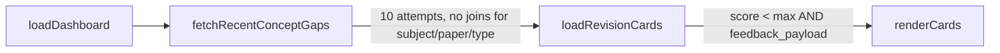
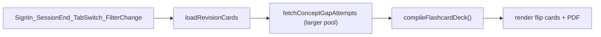

# Flashcard Deck Upgrade Plan

## Current behavior



- [`loadRevisionCards`](src/app.js) fetches the **10 most recent attempts** via [`fetchRecentConceptGaps`](src/dbClient.js) with minimal joins (`topic_name`, `spec_ref` only).
- No deduplication, no subject/paper/topic filtering, no `question_type` exclusion.
- Shared filters in [`index.html`](index.html) (`#subjectFilter`, `#paperFilter`, `#topicFilter`, `#typeFilter`) affect practice/analytics only; flashcards ignore them.
- Flashcards only refresh on `loadDashboard()` (sign-in / end of session), not on tab switch or filter change.

## Target behavior



| Requirement | Implementation |
|-------------|----------------|
| No duplicate cards | Dedupe by `question_id`; keep the **latest** attempt’s prompt/feedback |
| Repeat failures at top | Sort by `failureCount` desc, then `submitted_at` desc |
| Subject / Paper / Topic filter | Match `questions.spec_points.subject`, `.paper`, `.topic_name` against `getSelectedFilters()` |
| No extended response | Exclude `questions.question_type === "extended_response"` |
| Hide Question Type on Flashcards tab | Toggle visibility of the `#typeFilter` filter-group in `switchDashboardTab()` |

## 1. Expand the attempts query

Update [`fetchRecentConceptGaps`](src/dbClient.js) (rename to `fetchConceptGapAttempts` for clarity, keep old name as alias if preferred):

- Increase pool size from **10 → 100** (ordered `submitted_at` desc) so filtering/deduping still yields a useful deck.
- Expand select to include fields needed for filtering:

```js
.select(`
  submitted_at, question_id, score_total, score_max, feedback_payload,
  questions(
    question_type, prompt,
    spec_points(subject, paper, topic_name, spec_ref)
  )
`)
```

No server-side subject/paper filter initially — client-side filtering keeps the query simple and matches existing patterns in the app.

## 2. Add a pure compile step

Add `compileFlashcardDeck(attempts, { subject, paper, topic })` in [`src/app.js`](src/app.js) (or a small new helper in [`src/utils.js`](src/utils.js) if you prefer separation):

**Pass 1 — qualify attempts** (in `submitted_at` desc order):
- `score_total < score_max`
- truthy `feedback_payload`
- `question_type !== "extended_response"`
- `spec_points.subject` matches `subject` (case-insensitive)
- `spec_points.paper` matches `paper`
- if `topic` is non-empty, `spec_points.topic_name` must match; if empty, all topics in that paper

**Pass 2 — count failures per `question_id`** across qualified attempts.

**Pass 3 — dedupe**: for each `question_id`, keep the **most recent** qualified attempt (first seen while iterating desc).

**Pass 4 — sort** deck:
1. `failureCount` descending (your chosen priority)
2. `submitted_at` descending (tie-break)

Return the sorted array for both card rendering and PDF export.

## 3. Refactor `loadRevisionCards`

In [`src/app.js`](src/app.js):

- Read filters via existing `getSelectedFilters()` (ignore `qType` for flashcards).
- Call expanded fetch, then `compileFlashcardDeck`.
- Render cards from compiled list (existing HTML/flip logic unchanged).
- Pass compiled list to `downloadStudyGuideText`.
- Update empty-state copy to reflect active filters, e.g. *"No concept gaps for Biology · Paper 1 · [topic]"*.

## 4. Wire live refresh triggers

Update [`switchDashboardTab`](src/app.js):

- Hide/show the Question Type filter group (`#typeFilter` parent `.filter-group`) when `active === "flashcards"`.
- On entering Flashcards tab, call `loadRevisionCards()`.

Update filter `change` handlers for `subjectFilter`, `paperFilter`, `topicFilter`:

- Also call `loadRevisionCards()` (in addition to `loadTopics()`).

On app init ([`showSignedInLayout`](src/app.js) restores saved tab), `switchDashboardTab` will correctly hide `#typeFilter` if Flashcards was the last active tab.

**Do not** call `loadRevisionCards` from `typeFilter` change — that control is hidden on the Flashcards tab and irrelevant to the deck.

## 5. UI tweaks in `index.html`

- Add `id="typeFilterGroup"` to the Question Type `.filter-group` for reliable show/hide (avoids `:has()` dependency in JS).
- Optionally update the Flashcards panel description to mention that the deck follows the Subject / Paper / Topic selectors above.

No new flashcard-specific filter row is needed — requirement 2 is satisfied by the existing shared selectors.

## 6. Files touched

| File | Changes |
|------|---------|
| [`src/dbClient.js`](src/dbClient.js) | Expanded fetch query + higher limit |
| [`src/app.js`](src/app.js) | `compileFlashcardDeck`, refactor `loadRevisionCards`, tab/filter wiring |
| [`index.html`](index.html) | `id` on type filter group, optional copy tweak |

## Edge cases to handle

- **Missing join data** (`questions` or `spec_points` null): skip attempt safely.
- **All 100 attempts filtered out**: show contextual empty state (not the global “no gaps” celebration if other subjects have gaps).
- **PDF button**: hide when compiled deck is empty (existing behavior).
- **Practice tab unaffected**: `#typeFilter` remains visible and functional on Practice and Analytics tabs.

## Manual test plan

1. Fail the same MCQ twice → one card, appears near top with failure count 2 prioritized over single-failure cards.
2. Fail questions in Biology Paper 1 and Chemistry Paper 1 → switching subject/paper updates deck.
3. Select a specific topic → deck narrows to that topic only; “All topics” shows all gaps in the paper.
4. Fail an extended-response question → never appears in deck.
5. Switch to Flashcards tab → Question Type dropdown hidden; switch back to Practice → visible again.
6. Download PDF → matches on-screen filtered/deduped deck.
