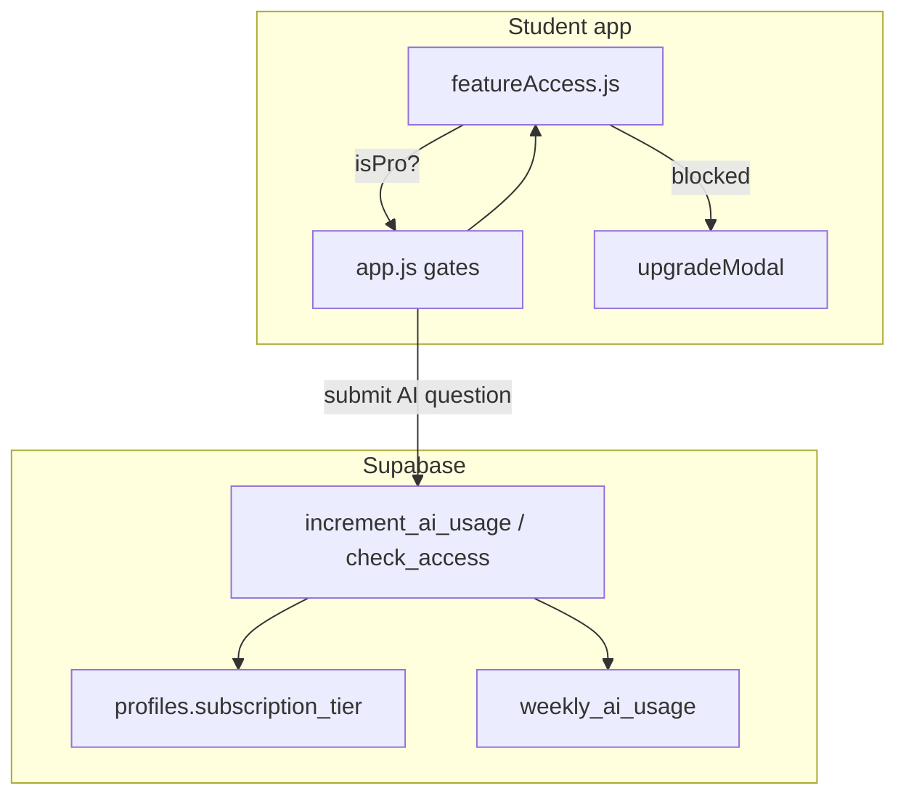

# Free vs Pro — Implementation Plan

**Source of truth:** [`gcse-competitive-analysis-and-growth.md`](gcse-competitive-analysis-and-growth.md) §5.5 and §5.2  
**Principle:** Keep core SRS **free** (Seneca-competitive hook). Gate **AI marking volume**, **full paper simulation**, **PDF flashcards**, **full analytics**, and **streak freeze**.

> **Status:** Phase 2 complete — gates in student app, landing page, teacher roster Plan column, developer pilot override in admin. Apply migrations in Supabase SQL Editor before testing quotas in production.

---

## Tier matrix (from competitive analysis)

| Feature | Free | Student Pro |
|---------|------|-------------|
| Account + onboarding | Yes | Yes |
| SRS Start Practice | **Unlimited** | Unlimited |
| MCQ / short answer / numeric (local marking) | Unlimited | Unlimited |
| Quick exam prep (10/20 questions) | Yes | Yes |
| **Half-paper simulation (35 marks)** | **1 per calendar month** | Unlimited |
| **Full paper simulation (70 marks)** | Locked | Unlimited |
| Mastery heatmap | **Basic** (view + due highlighting) | Full (click any cell to practise) |
| Flashcards (in-app deck) | Yes | Yes |
| **Flashcards PDF export** | Locked | Yes |
| **AI long-answer marking** (`mark-long-answer`) | **3 per rolling 7 days** | Unlimited |
| Analytics tab | Summary only (streak, due count, XP) | Full (AO, activity charts, MS/WS skills, forecast, mastery index) |
| Hints panel | All hints (XP penalty applies) | All hints |
| **Streak freeze** | No | Yes (1/week — future) |
| Class join | Yes | Pro if class has active licence |

**UI label:** "Student Pro" in upgrade prompts; database stays `profiles.subscription_tier = 'paid'`.

**Pricing (Phase 3 — Stripe):**

| Period | Price |
|--------|-------|
| Early adopters | **£15/year** |
| After launch | **£20/year** |

Checkout UI shows "coming soon" until Stripe is wired; upgrade modal displays both prices via `formatProPricing()`.

**Class licence (Phase 4 — Stripe):** Teacher/school pays → enrolled students get Pro automatically via `join_class_by_code`.

---

## Architecture



**Premium resolution:**

```javascript
isPro(profile, userClass) =
  profile.subscription_tier === 'paid'
  OR (userClass?.is_paid && userClass.paid_until > now())
  OR profile.role === 'developer'
```

Client gates = UX. Server RPC = enforcement (especially AI quota).

---

## Phase 2A — Database migration

New file: `supabase/migrations/20250617_free_pro_gates.sql`

```sql
-- Weekly AI marking quota (free tier)
create table if not exists weekly_ai_usage (
  user_id uuid references profiles(user_id) on delete cascade,
  week_start date not null,  -- ISO Monday of the week
  ai_marks_used int not null default 0,
  primary key (user_id, week_start)
);

-- Billing columns (needed before Stripe; manual override works now)
alter table profiles add column if not exists stripe_customer_id text;
alter table profiles add column if not exists stripe_subscription_id text;
alter table profiles add column if not exists subscription_status text
  default 'none' check (subscription_status in ('none','active','past_due','canceled'));

alter table classes add column if not exists is_paid boolean not null default false;
alter table classes add column if not exists paid_until timestamptz;
alter table classes add column if not exists stripe_subscription_id text;

-- RPC: consume one AI mark; returns { allowed, used, limit, is_pro }
create or replace function public.try_consume_ai_mark()
returns jsonb language plpgsql security definer set search_path = public as $$
declare
  v_tier text;
  v_week date;
  v_used int;
  v_limit int := 3;
begin
  if auth.uid() is null then
    return jsonb_build_object('allowed', false, 'reason', 'not_authenticated');
  end if;

  select subscription_tier into v_tier from profiles where user_id = auth.uid();
  if v_tier = 'paid' then
    return jsonb_build_object('allowed', true, 'is_pro', true, 'used', 0, 'limit', null);
  end if;

  v_week := date_trunc('week', current_date)::date;

  insert into weekly_ai_usage (user_id, week_start, ai_marks_used)
  values (auth.uid(), v_week, 0)
  on conflict (user_id, week_start) do nothing;

  select ai_marks_used into v_used
  from weekly_ai_usage where user_id = auth.uid() and week_start = v_week;

  if v_used >= v_limit then
    return jsonb_build_object('allowed', false, 'is_pro', false, 'used', v_used, 'limit', v_limit);
  end if;

  update weekly_ai_usage set ai_marks_used = ai_marks_used + 1
  where user_id = auth.uid() and week_start = v_week;

  return jsonb_build_object('allowed', true, 'is_pro', false, 'used', v_used + 1, 'limit', v_limit);
end;
$$;

grant execute on function public.try_consume_ai_mark() to authenticated;
```

Also update `join_class_by_code`: if class `is_paid = true` and `paid_until > now()`, set student `subscription_tier = 'paid'`.

Append to [`supabase/apply_in_sql_editor.sql`](supabase/apply_in_sql_editor.sql).

---

## Phase 2B — `src/featureAccess.js`

Central module — all tier logic in one place:

```javascript
export const FREE_AI_MARKS_PER_WEEK = 3;

export function resolveAccess(profile, classInfo = null) {
  const isPro =
    profile?.subscription_tier === 'paid' ||
    profile?.role === 'developer' ||
    (classInfo?.is_paid && new Date(classInfo.paid_until) > new Date());

  return {
    isPro,
    tier: isPro ? 'pro' : 'free',
    canPaperSim: isPro,
    canPdfFlashcards: isPro,
    canHeatmapPractice: isPro,
    canFullAnalytics: isPro,
    aiMarksLimit: isPro ? null : FREE_AI_MARKS_PER_WEEK,
  };
}

export function featureLabel(feature) { /* human-readable for upgrade modal */ }
```

Load class paid status in `fetchUserProfile` or a small join when `class_id` is set.

---

## Phase 2C — Wire gates in `src/app.js`

| Hook point | Free behaviour | Pro behaviour |
|------------|----------------|---------------|
| `btnExamPrep.onclick` | Allow 10/20 quick sets; **block 35/70** → upgrade modal | All modes |
| `renderMasteryHeatmap` callback | **No click handler** (read-only cells) | Click → `startSessionForSpecPoint` |
| `switchDashboardTab('analytics')` | Show **summary panel** only (streak, due, XP chip) | Full existing analytics tab |
| `switchDashboardTab('flashcards')` | Full in-app deck | Same |
| `btnDownloadStudyGuide.onclick` | Block → upgrade modal | Generate PDF |
| AI submit path (~line 2895) | Call `try_consume_ai_mark()` first; if denied → modal + local rubric fallback | Call AI unconditionally |
| `updateUserChipDisplay` | Badge shows `free` or `pro` | Same |

**Do NOT cap** daily Start Practice question count — competitive analysis explicitly keeps SRS unlimited on free.

### Upgrade modal (`app.html`)

Add `#upgradeModal` shell:

- Headline: "Upgrade to Student Pro"
- Bullets: unlimited AI examiner, full mock papers, PDF flashcards, full analytics
- CTA: "Upgrade" (disabled until Stripe Phase 3 — show "Coming soon" or manual contact)
- Secondary: "Continue with Free"

Show remaining AI marks in dashboard chip for free users: e.g. `AI: 2/3 this week`.

---

## Phase 2D — Analytics tab split

For free users, replace full `#dashboardTabAnalytics` content with a compact summary:

- Current streak
- Due today / overdue counts
- XP total
- Locked preview cards with blur + "Unlock with Pro" for AO charts, activity graph, mastery index

Pro users see existing full tab unchanged.

---

## Phase 2E — Landing page alignment

Update [`index.html`](index.html) pricing table to match tier matrix above. Key messaging change:

- **Old:** "15 questions/day" on Start Practice  
- **New:** "Unlimited SRS practice" on Free; gate AI marking and paper sims instead

Lead with competitive positioning from the analysis:

> *"Free spaced repetition scheduling. Pro unlocks the AI examiner and full mock papers."*

---

## Phase 2F — Teacher portal (read-only for now)

Teachers see student `subscription_tier` on roster (already shown as "Plan"). Optional: manual "Grant Pro" dropdown for pilot schools before Stripe — updates `profiles.subscription_tier` via RPC (teacher cannot self-promote; developer-only or service role).

---

## Testing checklist

1. Free user: unlimited Start Practice sessions in one day — no block
2. Free user: 10/20 exam prep works; **1×35-mark half-paper per month**; 2nd half-paper and 70-mark full paper show upgrade modal
3. Free user: 3 AI marks in a week → 4th shows upgrade modal; local rubric fallback still works
4. Free user: heatmap cells not clickable; Pro user can click
5. Free user: analytics tab shows summary only; Pro sees full charts
6. Free user: PDF download blocked; in-app flashcards work
7. Developer / `subscription_tier = paid` bypasses all gates
8. Student in paid class gets Pro after join (once class licence migration applied)

---

## Implementation order

| Step | Files | Depends on |
|------|-------|------------|
| 1 | Migration SQL | — |
| 2 | `src/featureAccess.js` | — |
| 3 | `src/dbClient.js` — `tryConsumeAiMark()`, fetch class licence | Migration |
| 4 | `app.html` — upgrade modal | — |
| 5 | `src/app.js` — all gates | 2, 3, 4 |
| 6 | `styles.css` — locked tab / modal styles | 4, 5 |
| 7 | `index.html` — pricing table update | — |
| 8 | Manual Pro override for pilot (optional) | Migration |

**Stripe checkout (Phase 3)** comes after gates work with manual `subscription_tier = paid` overrides for testing.

---

## Deferred (competitive analysis — not Phase 2)

| Feature | Doc reference | Phase |
|---------|---------------|-------|
| Streak freeze | §5.4, §5.5 Pro tier | Phase 2+ or with Stripe |
| Teacher assignments | §3.1, §5.7 Month 2 | Separate homework plan |
| Email SRS reminders | §5.2 | Month 2 retention |
| Guest demo (5 Q, no account) | §5.3 | Month 1 acquisition |
| Referral programme | §5.2 | Post-launch |

---

## Related docs

- [`gcse-competitive-analysis-and-growth.md`](gcse-competitive-analysis-and-growth.md) — full competitive landscape
- [`production_rollout_plan.md`](production_rollout_plan.md) — hosting, Stripe, auth (Phase 1 done)
- [`teacher_dashboard_enhancement_plan.md`](teacher_dashboard_enhancement_plan.md) — homework (school workflow)
