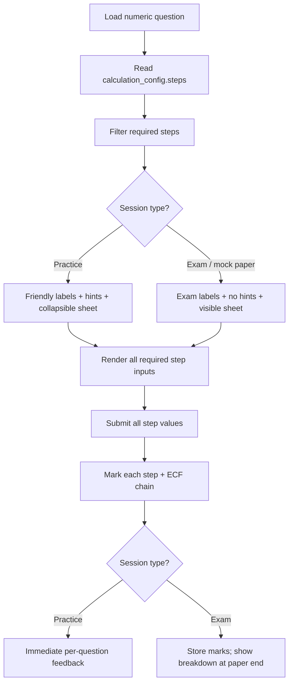

# Physics Calculation Workflow Plan

## Goal

Model the GCSE physics calculation process students follow on exam paper:

1. Identify correct equation (from equation sheet for higher demand; given in prompt for low demand)
2. Substitute values into equation
3. Unit conversion (when needed)
4. Rearrange equation (when needed)
5. Calculate final answer
6. Round to required significant figures (when needed)

**Confirmed design choices:**

- Shared equation sheets with per-question overrides
- **Single calculation system** — replace `scaffold_config` entirely with `calculation_config`; existing numeric questions re-authored manually (no legacy adapter)
- **Exam mode uses the same step workflow** as practice — students always follow the full route to build exam habits; practice vs exam differs in presentation and support, not in which steps are required

---

## Current state (baseline)

The app has a **partial scaffold** on `question_type = "numeric"` via `scaffold_config`:

| Exam step | Current support |
|-----------|-----------------|
| Equation selection | Partial — rearranged-formula MCQ only, not base equation from sheet |
| Substitution | Missing |
| Unit conversion | Partial — single numeric checkpoint |
| Rearrangement | Partial — string-exact MCQ |
| Calculate | Yes — tolerance match on `answer_keys.key_payload.answer` |
| Significant figures | Missing |

Key files today:

- Rendering: [`src/uiComponents.js`](src/uiComponents.js) (lines 63–116)
- Grading: [`src/evalEngine.js`](src/evalEngine.js) (lines 357–436)
- Response capture: [`src/app.js`](src/app.js) (`getResponsePayload`)
- Authoring: [`admin.html`](admin.html) (numeric panel ~643–699)

This scaffold will be **removed** once `calculation_config` is live.

---

## Target architecture

### 1. Replace `scaffold_config` with `calculation_config`

**Migration:** add `calculation_config jsonb`, drop `scaffold_config` (after re-authoring existing questions).

Every numeric calculation question **must** have a `calculation_config`. Simple low-demand questions use a minimal config (e.g. `calculate` only, with `equation_given: true`).

```json
{
  "equation_given": false,
  "equation_sheet_id": "physics_p2_ht",
  "equation_override_distractors": null,
  "steps": [
    { "type": "equation_select", "marks": 1, "ao": "AO1", "required": true,
      "answer": "kinetic_energy" },
    { "type": "substitution", "marks": 1, "ao": "AO2", "required": true,
      "accepted": ["E_k = 0.5 × 2.0 × 4.0²", "Ek = 0.5 * 2 * 4^2"] },
    { "type": "conversion", "marks": 1, "ao": "AO2", "required": false,
      "label": "Convert km to m", "answer": 1200, "tolerance": 1 },
    { "type": "rearrangement", "marks": 1, "ao": "AO2", "required": false,
      "answer": "v = s / t", "distractors": ["v = s / t", "v = s * t", "t = s / v"] },
    { "type": "calculate", "marks": 1, "ao": "AO2", "required": true },
    { "type": "sig_figs", "marks": 0, "ao": "AO2", "required": false,
      "sig_figs": 2, "enforce_on_final": true }
  ]
}
```

**Low vs high demand presets** (authoring shortcuts tied to `demand_level`):

| Demand | `equation_given` | Typical enabled steps |
|--------|-------------------|----------------------|
| `low`, `standard` | `true` (equation in prompt) | calculate; optional conversion, sig_figs |
| `standard_45`, `standard_67`, `high_89` | `false` | equation_select, substitution, conversion, rearrangement, calculate, sig_figs (each toggled per question) |

---

### 2. Practice vs exam mode — same steps, different support

Both modes render **all required steps** as inputs. The session type changes UX around the workflow, not the workflow itself.

| Aspect | Practice mode | Exam mode |
|--------|---------------|-----------|
| Step inputs | All required steps shown | All required steps shown (same) |
| Step labelling | Friendly labels (“Step 1: Choose equation”) | Exam-style labels (“Write the equation used”, “Substitute values”) |
| Hints | Full progressive hints panel | Hints hidden or disabled |
| Equation sheet | Collapsible reference panel | Always visible reference panel (mirrors real paper) |
| Feedback timing | Immediate on submit per question | Deferred until end of paper session (or per-question submit in timed mock — configurable) |
| Submit validation | Warn if steps empty | Require all required steps filled before submit |
| Marking | Full per-step marks + ECF | Full per-step marks + ECF (same engine) |



Session mode is passed from [`src/sessionEngine.js`](src/sessionEngine.js) / [`src/paperBuilder.js`](src/paperBuilder.js) — not stored on the question row.

---

### 3. Shared equation sheets (new table)

Migration: `supabase/migrations/YYYYMMDD_equation_sheets.sql`

```sql
create table equation_sheets (
  id text primary key,
  subject text not null,
  title text not null,
  tier text,
  equations jsonb not null
);
```

Example equation entry:

```json
{ "id": "kinetic_energy", "label": "Kinetic energy", "latex": "E_k = \\frac{1}{2} m v^2", "topic_tags": ["energy"] }
```

- **Default:** `equation_select` step draws options from the linked sheet
- **Override:** `equation_override_distractors` narrows to 4–6 plausible equations for one question
- Render with MathJax via [`src/mathEngine.js`](src/mathEngine.js)

---

### 4. Step types — UI and grading

Central module: [`src/calculationWorkflow.js`](src/calculationWorkflow.js)

| Step type | UI | Grading |
|-----------|-----|---------|
| `equation_select` | MCQ dropdown (sheet or override) | Match `step.answer` (equation id) → AO1 |
| `substitution` | Text input | Normalized string compare against `step.accepted[]` |
| `conversion` | Numeric input + label | Tolerance vs `step.answer`; ECF to calculate |
| `rearrangement` | MCQ dropdown | Exact string match |
| `calculate` | Numeric input + unit badge | Tolerance vs `answer_keys.key_payload.answer` |
| `sig_figs` | Prompt on calculate field (“Give to N s.f.”) | `sigFigs.js` validates rounding |

**Response payload** (stored in `attempts.response_payload`):

```json
{
  "type": "numeric",
  "sessionMode": "exam",
  "steps": {
    "equation_select": "kinetic_energy",
    "substitution": "E_k = 0.5 × 2.0 × 4.0²",
    "conversion": 1200,
    "rearrangement": "v = s / t",
    "calculate": 16
  },
  "unit": "J"
}
```

**ECF chain:** wrong conversion or substitution still allows calculate mark if final value is arithmetically consistent with the student's prior steps.

---

### 5. Significant figures utility

New [`src/sigFigs.js`](src/sigFigs.js):

- `countSigFigs(value)`
- `roundToSigFigs(value, n)`
- `matchesSigFigs(studentValue, expectedValue, n, tolerance)`

When `sig_figs` step is enabled with `enforce_on_final: true`, the calculate input is graded against the rounded expected value.

---

### 6. Mark allocation and AO alignment

- `max_marks` = sum of `step.marks` where `required: true`
- Validated in [`src/adminMetadata.js`](src/adminMetadata.js) against AO fields
- Per-step feedback via `mark_points` keyed by step type (e.g. `[calc:conversion]`)

---

### 7. Admin authoring UX

Replace the current scaffold toggles in [`admin.html`](admin.html) with a single **Calculation workflow** panel:

1. Preset: Low demand (equation given) / High demand (from sheet) / Custom
2. Equation source: shared sheet picker OR override distractors
3. Step checklist (6 steps) with per-step config
4. Sandbox preview with practice/exam UX toggle (same steps, different labels/hints)
5. **No migration helper** — authors re-edit existing numeric questions directly

Remove all `scaffold_config` UI and DB references once content is migrated.

---

### 8. Hints integration

- Practice mode only (hidden in exam mode)
- Author hints in step order: equation family → conversion/rearrange → numeric setup

---

## Implementation phases

### Phase 1 — Single step engine (foundation)
- Add `calculation_config` column; plan to drop `scaffold_config` after content migration
- Create `calculationWorkflow.js` — render, collect payload, mark steps
- Replace numeric branches in `evalEngine.js`, `uiComponents.js`, `app.js`
- Remove old scaffold code paths (no adapter)
- Admin: basic step builder (conversion, rearrangement, calculate — parity with old scaffold)

### Phase 2 — Equation sheet + selection step
- `equation_sheets` table + seed physics sheets
- `equation_select` step + reference panel
- Admin sheet picker + override distractors

### Phase 3 — Substitution + sig figs
- `substitution` text step + normalization
- `sigFigs.js` + sig figs grading

### Phase 4 — Practice vs exam presentation
- `sessionMode` through session engine
- Exam UX: exam-style labels, no hints, visible equation sheet, deferred paper feedback
- Practice UX: friendly labels, hints, immediate feedback
- **Same steps and marking in both modes**

### Phase 5 — Content migration + polish
- Manually re-author existing numeric questions into `calculation_config`
- Drop `scaffold_config` column (migration)
- Authoring presets from `demand_level`
- Fix numeric CSV bulk import
- Optional step-level analytics from `response_payload.steps`

---

## Files to create / modify

| File | Change |
|------|--------|
| `supabase/migrations/YYYYMMDD_calculation_workflow.sql` | Add `calculation_config`; later migration drops `scaffold_config` |
| `src/calculationWorkflow.js` | **New** — single render/mark/collect module |
| `src/sigFigs.js` | **New** |
| `src/evalEngine.js` | Delegate numeric marking to workflow module |
| `src/uiComponents.js` | Delegate rendering; equation sheet panel |
| `src/app.js` | Step payload; sessionMode; exam deferred feedback |
| `src/sessionEngine.js` | Load `calculation_config`; pass sessionMode |
| `src/paperBuilder.js` | Exam sessionMode + deferred feedback aggregation |
| `src/adminMetadata.js` | Presets, step/mark validation |
| `admin.html` | Replace scaffold panel; remove scaffold fields |
| `data/equation_sheets/` | Seed JSON for physics sheets |

---

## Risks and mitigations

| Risk | Mitigation |
|------|------------|
| Substitution string matching too brittle | Normalize aggressively; author provides multiple `accepted` variants |
| Scope creep (CAS) | Stay numeric + MCQ + normalized text only |
| Breaking existing questions on deploy | Deploy `calculation_config` first; re-author before dropping `scaffold_config`; flag unmigrated questions in admin |
| Exam mode feels slow with many steps | Only enable steps genuinely needed per question; low-demand questions may be calculate-only |
| Deferred exam feedback complexity | Store per-question marking in session state; show summary card at paper end |

---

## Success criteria

- One calculation system only — no `scaffold_config` code paths remain
- Low-demand: equation in prompt; student completes configured steps (often calculate ± conversion/SF)
- High-demand: student selects from equation sheet and completes all configured steps
- **Exam and practice sessions both require the same steps** — exam mode differs in labels, hints, sheet visibility, and feedback timing only
- Marks and AO breakdown reflect per-step performance in both modes
- Existing numeric questions re-authored into new format before scaffold column is dropped
