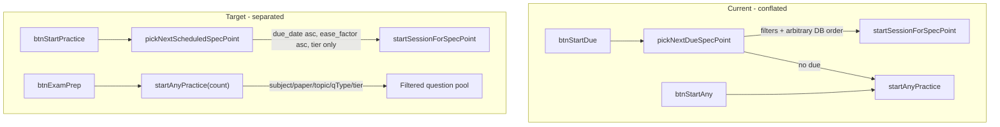

# Practice Mode Split and Schedule Ordering

## Current state

Two buttons overlap in purpose and placement:

- [`btnStartDue`](index.html) — calls `pickNextDueSpecPoint()` which ignores schedule ordering and applies subject/paper/topic/qType filters; falls back to `startAnyPractice` when nothing is due.
- [`btnStartAny`](index.html) — calls `startAnyPractice()` with filter-scoped random questions, hard-coded `.slice(0, 10)`.

The **Active Schedule Forecast** ([`dueList`](index.html)) is rendered from [`fetchDashboardDueItems`](src/dbClient.js) with explicit ordering:

```22:23:src/dbClient.js
    .order("due_date", { ascending: true })
    .order("ease_factor", { ascending: true });
```

That ordering is **not** used by `pickNextDueSpecPoint` today.



---

## 1. UI restructure in [`index.html`](index.html)

**New block above `.filter-row`** (visible on all dashboard tabs, one-click entry):

```html
<div class="schedule-practice-block">
  <button id="btnStartPractice" class="btn-primary">Start Practice</button>
  <p id="startPracticePreview" class="muted">Loading schedule…</p>
</div>
```

- Add matching styles (reuse `.practice-context-block` pattern: flex row, subtle background).
- Preview copy when due items exist: *"10 questions on {topic_name} ({spec_ref})"* using the first schedulable item.
- When nothing due / no tier-matching questions: disable button + message e.g. *"Nothing due in your schedule"*.

**Exam preparation block** (stays inside `#dashboardTabPractice`, below filters):

- Rename [`btnStartAny`](index.html) label to **"Exam preparation"**.
- Add `<select id="examPrepCount">` with options **10** (default), **20**, **30** beside the button.
- Keep [`topicCountSummary`](index.html) as the filter-scoped pool description.

**Remove duplicate start button** from the Due Item Queue header (line ~477) — list becomes read-only schedule view.

**Exam preparation controls** — wrap count select + button in a dedicated container:

```html
<div class="exam-prep-controls">
  <select id="examPrepCount" class="custom-select">…</select>
  <button id="btnExamPrep" class="btn-secondary">Exam preparation</button>
</div>
```

---

## 1b. Responsive layout (mobile fix)

**Root cause:** There are currently **no `@media` queries** in [`index.html`](index.html) or [`styles.css`](styles.css). `.practice-context-block` uses `display: flex; justify-content: space-between` with a long-label button set to `flex: none; width: auto`, so on narrow screens the button overflows or clips instead of reflowing.

Apply responsive styles while building the new blocks (prefer [`styles.css`](styles.css) over inline styles so rules are reusable):

**Shared practice-action layout** (`.schedule-practice-block`, `.practice-context-block`, `.exam-prep-controls`):

- `display: flex; flex-wrap: wrap; align-items: center; gap: 12px`
- Summary/preview text: `flex: 1 1 200px; min-width: 0` (allows wrapping, prevents flex overflow)
- Action buttons: `flex: 0 1 auto; white-space: normal; text-align: center`
- Override global `button { flex: 1 }` inside these blocks with `.practice-action-btn { flex: 0 1 auto }` class on Start Practice / Exam preparation buttons

**Mobile breakpoint** (`@media (max-width: 600px)`):

- Stack blocks vertically: `flex-direction: column; align-items: stretch`
- Buttons and selects go **full width**: `width: 100%`
- Reduce horizontal padding on blocks; slightly smaller font on preview text
- `.filter-row` filter groups: `width: 100%` / `min-width: 0` so topic dropdown doesn't force horizontal scroll
- `#summaryActions.btn-group`: stack buttons full-width (session complete screen)

**Avoid** long unbreakable button labels clipping — "Exam preparation" is short enough; preview text lives in `<p>`, not on the button.

Remove inline `flex: none; width: auto` from practice buttons when adding the CSS classes above.

---

## 2. Rewrite schedule picker in [`src/app.js`](src/app.js)

Replace `pickNextDueSpecPoint` with `pickNextScheduledSpecPoint({ excludeSpecPointId } = {})`:

1. Fetch ordered due items via existing [`fetchDashboardDueItems`](src/dbClient.js) — **no** subject/paper/topic/qType filtering.
2. Optionally exclude `excludeSpecPointId` (for session-summary "Next due spec point").
3. Batch-check question availability: single `questions` query for all candidate `spec_point_id`s, filtered by **tier only** (`HT` → `["HT","both"]`, `FT` → `["FT","both"]`).
4. Walk the due list in order; return the first spec-point that has ≥1 matching question.
5. Return `{ specPointId, specMeta }` or `{ noDue: true }` / `{ noQuestions: true }`.

Add `updateStartPracticePreview(dueItems)` called from [`loadDashboard`](src/app.js) after due data loads — uses the same walk logic (or caches last pick result) to populate `#startPracticePreview` and enable/disable `#btnStartPractice`.

**Remove** the `loadTopics` block (lines ~1396–1420) that mutates `btnStartDue` text based on filters — no longer relevant.

---

## 3. Wire new button handlers in [`src/app.js`](src/app.js)

| Handler | Behaviour |
|---------|-----------|
| `#btnStartPractice` | `pickNextScheduledSpecPoint()` → `startSessionForSpecPoint(id, "", engineContext)`. **No** fallback to exam prep. Show toast on `noDue` / `noQuestions`. |
| `#btnExamPrep` | Read `#examPrepCount` → `startAnyPractice(engineContext, count)`. |

Update session-summary handlers (~800–825):

- "More questions for this spec point" — call `startSessionForSpecPoint(sessionSpecPointId, "", …)` (no qType).
- "Next due spec point" — call `pickNextScheduledSpecPoint({ excludeSpecPointId })` (schedule order, no filters).

Heatmap click ([`loadDashboard`](src/app.js) ~225) — keep explicit spec-point selection; drop qType filter for consistency (`startSessionForSpecPointWrapper(id)` with empty qType).

Rename DOM refs: `btnStartDue` → `btnStartPractice` throughout [`src/app.js`](src/app.js).

---

## 4. Engine changes in [`src/sessionEngine.js`](src/sessionEngine.js)

**`startSessionForSpecPoint`** — no logic change to ordering (caller supplies ID). Continues to load up to 10 questions, shuffled; tier filter stays; qType only applied when non-empty (schedule path passes `""`).

**`startAnyPractice`** — add `questionCount = 10` parameter:

```js
const localizedQs = shuffleArray(activeQs).slice(0, questionCount);
```

Pass count from `engineContext` or as a direct argument from the exam-prep click handler.

---

## 5. Behaviour summary

| | Start Practice | Exam preparation |
|--|----------------|------------------|
| **Trigger** | `#btnStartPractice` (above filters) | `#btnExamPrep` + count select |
| **Spec-point** | Next in Active Schedule Forecast order | Random across filtered pool |
| **Filters** | None (tier header only) | Subject, paper, topic, qType, tier |
| **Question count** | Fixed 10 | 10 / 20 / 30 (user choice) |
| **Empty state** | Disabled button + message; no fallback | Existing toast if pool empty |

---

## Files touched

- [`index.html`](index.html) — layout, new elements, remove duplicate button, semantic class hooks
- [`styles.css`](styles.css) — responsive practice-action layout and mobile breakpoint (primary home for new CSS)
- [`src/app.js`](src/app.js) — picker rewrite, handlers, preview update, cleanup
- [`src/sessionEngine.js`](src/sessionEngine.js) — `questionCount` param on `startAnyPractice`

No database schema changes required.
