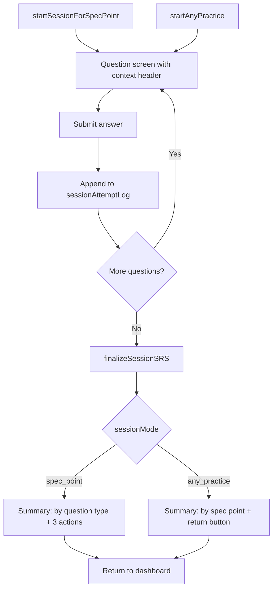

# Question Flow: Context Header + Session Summary

## Current behavior

- Questions render in [`index.html`](index.html) `#session` with progress in `#progress` and content in `#qBox` via [`loadQuestion()`](src/app.js).
- Session ends in `btnNext.onclick` when `idx >= sessionQuestions.length`: it hides `#session`, shows `#dashboard`, runs `finalizeSessionSRS()`, and reloads dashboard data — **no summary step**.
- Two entry paths exist in [`sessionEngine.js`](src/sessionEngine.js):
  - **`startSessionForSpecPoint`** — heatmap click, "due questions" button (all target one spec point)
  - **`startAnyPractice`** — "Start practice" button (up to 10 shuffled questions, possibly many spec points)
- Questions only carry `spec_point_id`; spec metadata (`subject`, `paper`, `topic_name`, `spec_ref`, `spec_text`) lives on `spec_points`.
- Outcome classification already exists as `classifyAttemptOutcome()` in [`app.js`](src/app.js) (full / partial / fail from `score_total` / `score_max`).



---

## 1. Session state and data loading

**Extend session state in [`app.js`](src/app.js):**

```javascript
let sessionMode = null;           // 'spec_point' | 'any_practice'
let sessionSpecPointId = null;    // set for spec_point mode
let sessionAttemptLog = [];       // per-question outcomes for summary
```

Expand `engineContext.setSessionState` to accept a config object:

```javascript
setSessionState(questions, index, { mode, specPointId })
```

**Join spec metadata when loading questions** in [`sessionEngine.js`](src/sessionEngine.js) — add to both `.select(...)` clauses:

```javascript
spec_points(subject, paper, topic_name, spec_ref, spec_text)
```

Pass mode when calling `setSessionState`:
- `startSessionForSpecPoint` → `{ mode: 'spec_point', specPointId }`
- `startAnyPractice` → `{ mode: 'any_practice' }`

Reset `sessionAttemptLog = []` whenever a new session starts.

---

## 2. Question screen: context header

**HTML** — add a container in [`index.html`](index.html) inside `#session`, between `#progress` row and `#qBox`:

```html
<div id="sessionContext" class="session-context hidden"></div>
```

**Rendering** — new helper in [`uiComponents.js`](src/uiComponents.js):

- `renderSessionContext(specPoint)` — displays Subject · Paper · Topic, then spec ref chip + spec text (matching dashboard due-list style at lines 236–238 of `app.js`).

**Wire up in `loadQuestion()`** ([`app.js`](src/app.js)):
- Read `currentQ.spec_points` from the joined data.
- Populate `#sessionContext` and remove `hidden`.
- Hide `#sessionContext` when showing the summary view.

Label formatting (reuse existing patterns):
- Subject: capitalized (`physics` → Physics)
- Paper: `paper1` → Paper 1
- Spec ref: chip (e.g. `4.5.1.1`)

---

## 3. Track per-question outcomes during session

After each successful mark + `attempts` insert in `btnSubmit.onclick` ([`app.js`](src/app.js) ~lines 1624–1698), push to `sessionAttemptLog`:

```javascript
{
  questionId,
  questionType: currentQ.question_type,
  specPointId: currentQ.spec_point_id,
  specPoint: currentQ.spec_points,   // for summary labels
  scoreTotal,
  scoreMax,
  outcome: classifyAttemptOutcome({ score_total, score_max })
}
```

Keep existing `sessionQualityLog` for SRS — no change to `finalizeSessionSRS()`.

---

## 4. Summary screen UI

**HTML** — add inside `#session`:

```html
<div id="sessionSummary" class="hidden">
  <div id="summaryContent"></div>
  <div id="summaryActions" class="btn-group"></div>
</div>
<div id="questionView">  <!-- wrap existing qBox, feedback, btn-group -->
  ...
</div>
```

**New render helpers in [`uiComponents.js`](src/uiComponents.js):**

| Function | Purpose |
|---|---|
| `QUESTION_TYPE_LABELS` | Map `mcq`, `numeric`, `short_text`, `extended_response` to display names |
| `aggregateOutcomesByQuestionType(log)` | `{ mcq: { full, partial, fail }, ... }` |
| `aggregateOutcomesBySpecPoint(log)` | Group by `specPointId`, each with full/partial/fail counts |
| `renderOutcomeBreakdownTable(rows)` | Reuse green/amber/red from activity chart (`var(--success)`, `#f39c12`, `var(--error)`) |
| `renderSpecPointSessionSummary(meta, byType)` | Header + type breakdown table |
| `renderAnyPracticeSessionSummary(bySpecPoint)` | Per-spec-point breakdown rows |

**Show summary** — replace the dashboard jump in `btnNext.onclick` (lines 1711–1723) with `showSessionSummary()`:

1. `await finalizeSessionSRS()`
2. Hide `#questionView`, show `#sessionSummary`
3. Change `#progress` text to "Session complete"
4. Render content based on `sessionMode`

**Return to dashboard** — shared `exitSessionToDashboard()`:
- Hide `#session` and `#sessionSummary`, show `#dashboard`
- Reset session state
- `loadDashboard()` + `loadWeeklyForecast()` (existing reload logic)

---

## 5. Summary actions by mode

### `spec_point` mode (includes heatmap + due-questions button)

Top of summary: subject, paper, topic, spec ref + spec text (same as question header).

Breakdown table: rows = question types attempted; columns = Right / Partially right / Wrong.

Three buttons in `#summaryActions`:

| Button | Action |
|---|---|
| **More questions for this spec point** | `exitSessionToDashboard()` then `startSessionForSpecPoint(sessionSpecPointId, qType, engineContext)` |
| **Next due spec point** | Extract due-spec selection from `btnStartDue` into shared `pickNextDueSpecPoint(excludeId)`; if found, restart spec-point session; else toast + return to dashboard |
| **Return to dashboard** | `exitSessionToDashboard()` |

### `any_practice` mode

Breakdown: one row per spec point touched in the session (topic + spec ref label), with full/partial/fail counts.

Single button: **Return to dashboard** → `exitSessionToDashboard()`.

---

## 6. Styles

Add minimal CSS in [`styles.css`](styles.css):
- `.session-context` — muted breadcrumb row with chips, spacing below progress
- `.session-summary` — card-style breakdown table, outcome count badges aligned with existing activity chart colors

Prefer existing `.chip`, `.item`, `.btn-primary`, `.btn-secondary` classes where possible.

---

## 7. Refactor: shared "next due spec point" logic

Extract from `btnStartDue.onclick` ([`app.js`](src/app.js) lines 488–560) into:

```javascript
async function pickNextDueSpecPoint({ excludeSpecPointId } = {})
```

Returns `{ specPointId } | null`. Used by both the due button and summary action (b), with `excludeSpecPointId: sessionSpecPointId` so the user gets a different spec point.

---

## Files changed

| File | Changes |
|---|---|
| [`index.html`](index.html) | `#sessionContext`, `#sessionSummary`, wrap `#questionView` |
| [`src/sessionEngine.js`](src/sessionEngine.js) | Join `spec_points`, pass session mode to `setSessionState` |
| [`src/app.js`](src/app.js) | Session state, context in `loadQuestion`, attempt log, `showSessionSummary`, `exitSessionToDashboard`, extract `pickNextDueSpecPoint` |
| [`src/uiComponents.js`](src/uiComponents.js) | Context header + summary renderers + aggregation helpers |
| [`styles.css`](styles.css) | Context bar and summary table styling |

No database schema changes required.

---

## Test plan

1. **Heatmap → spec-point session**: confirm context header shows on each question; after last question, summary shows correct spec header + breakdown by type; test all three action buttons.
2. **Due questions button**: same summary as heatmap (spec_point mode).
3. **Start practice (any)**: context header updates per question when spec points differ; summary groups by spec point; return button goes to dashboard.
4. **Edge cases**: session with only one question type; session where all answers are wrong; "next due spec point" when no other due items remain (toast + dashboard).
5. **SRS**: verify spaced-repetition still updates on session complete before summary is shown.
