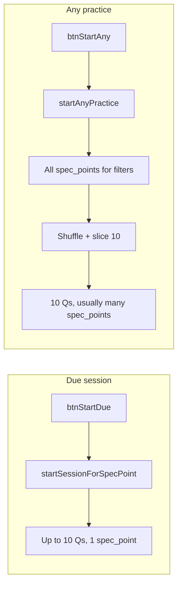
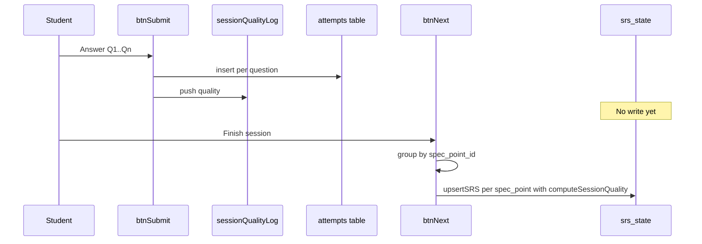

# Session-level SRS updates

## Confirmation: how `startAnyPractice` selects questions

**Yes — it does not pick 10 questions from one spec point.** The flow in [`src/sessionEngine.js`](src/sessionEngine.js) is:

1. Load **all** `spec_points` matching `subject`, `paper`, and optional `topic` filter.
2. Load **all** `questions` whose `spec_point_id` is in that set, filtered by `tier` and optional `question_type`.
3. `shuffleArray(activeQs).slice(0, 10)` — random 10 from the **combined pool** across many spec points.

So a typical session spans multiple spec points. The edge case (all 10 from one spec point) is possible only if the pool is very small or shuffle is unlucky.

By contrast, [`startSessionForSpecPoint`](src/sessionEngine.js) (used by **Start Due**) loads up to 10 questions for a **single** `spec_point_id` — always one spec point per session.



---

## Target behaviour

| When | SRS update timing | Aggregation |
|------|-----------------|-------------|
| Due session (`startSessionForSpecPoint`) | Session end | All answers → one `upsertSRS` for that spec point |
| Any practice (`startAnyPractice`) | Session end | Group answers by `spec_point_id`; one `upsertSRS` per spec point touched |

Individual `attempts` rows continue to be inserted **per question** on submit (unchanged).

**Incomplete sessions** (user leaves before finishing all questions): no SRS write — acceptable; only answered questions are in the log and finalize runs only when the last question is completed.

---

## Quality mapping (session pass rate → SM-2 quality)

Add `computeSessionQuality(qualities: number[]): number` in [`src/evalEngine.js`](src/evalEngine.js).

Define **pass** as `quality >= 3` (aligned with existing SM-2 lapse threshold in `updateSRS`).

| Pass rate (`passCount / total`) | Session `quality` | Effect |
|--------------------------------|-------------------|--------|
| >= 90% | 5 | Strong pass — interval advances |
| 70–89% | 4 | Good pass — advances, slightly lower EF bump |
| 50–69% | 3 | Borderline — advances without lapse |
| 25–49% | 1 | Weak — lapse, due tomorrow |
| < 25% | 0 | Fail — lapse, due tomorrow |

Examples:
- 9/10 pass, 1 fail (MCQ wrong) → 90% → `quality 5` (fixes the unfair reset)
- 1/1 in a mixed session → 100% → `quality 5`
- 0/1 → 0% → `quality 0`

---

## Code changes

### 1. Session result tracking — [`src/app.js`](src/app.js)

Add module-level state:

```javascript
let sessionQualityLog = []; // { specPointId, quality }
```

Reset in `setSessionState` (inside `engineContext`):

```javascript
setSessionState: (questions, index) => {
  sessionQuestions = questions;
  idx = index;
  sessionQualityLog = [];
},
```

### 2. Record quality on submit instead of immediate SRS — [`src/app.js`](src/app.js)

In the submit handler (~lines 1333–1393), replace all three `await upsertSRS(...)` calls with:

```javascript
sessionQualityLog.push({ specPointId: currentQ.spec_point_id, quality });
```

Keep `attempts.insert` calls unchanged.

### 3. Finalize SRS on session end — [`src/app.js`](src/app.js)

Add helper (local or imported from `evalEngine.js`):

```javascript
async function finalizeSessionSRS() {
  const bySpec = new Map();
  for (const { specPointId, quality } of sessionQualityLog) {
    if (!bySpec.has(specPointId)) bySpec.set(specPointId, []);
    bySpec.get(specPointId).push(quality);
  }
  for (const [specPointId, qualities] of bySpec) {
    const sessionQuality = computeSessionQuality(qualities);
    await upsertSRS(specPointId, sessionQuality);
  }
  sessionQualityLog = [];
}
```

Call `await finalizeSessionSRS()` in `btnNext` when `idx >= sessionQuestions.length`, **before** `loadDashboard()` so the dashboard reflects new due dates.

### 4. Export mapping function — [`src/evalEngine.js`](src/evalEngine.js)

```javascript
export function computeSessionQuality(qualities) {
  if (!qualities.length) return 0;
  const passCount = qualities.filter(q => q >= 3).length;
  const rate = passCount / qualities.length;
  if (rate >= 0.9) return 5;
  if (rate >= 0.7) return 4;
  if (rate >= 0.5) return 3;
  if (rate >= 0.25) return 1;
  return 0;
}
```

Import in `app.js` alongside `updateSRS`.

### 5. No changes needed to session starters

[`startAnyPractice`](src/sessionEngine.js) and [`startSessionForSpecPoint`](src/sessionEngine.js) already call `setSessionState`; resetting the log there is sufficient. [`upsertSRS`](src/sessionEngine.js) and SM-2 math stay unchanged — still one call per spec point, but with aggregated quality.

---

## Data flow (after change)



---

## Testing checklist

- **Due session**: 9 correct + 1 wrong MCQ on same spec point → `srs_state` should advance (not due tomorrow).
- **Due session**: 3/10 correct → lapse, `interval_days = 1`.
- **Any practice, mixed spec points**: 10 questions from ~10 spec points → 10 separate `upsertSRS` calls, each from a 1-question pass/fail rate.
- **Any practice, accidental single spec point**: 10 questions, one spec point → single aggregated update.
- **Attempts table**: still one row per answered question.
- **Abandoned session**: exit mid-session → no `srs_state` change (verify acceptable).
