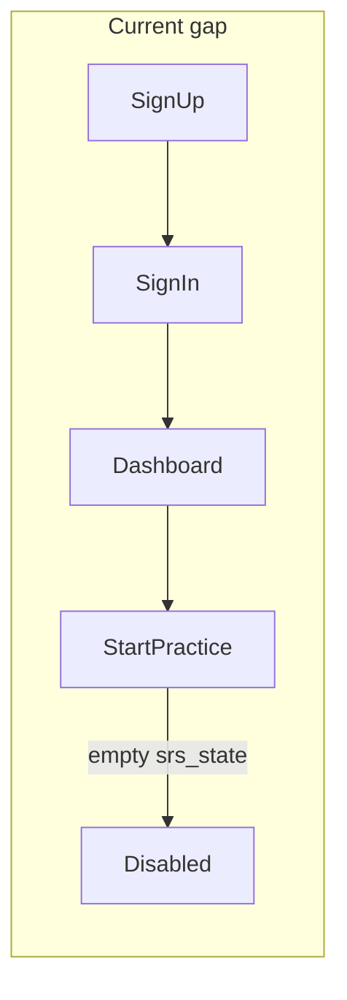
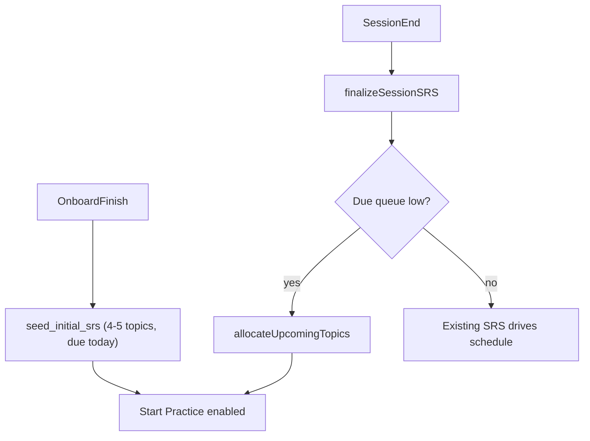

# Sign-up onboarding and user profile plan

## Current state

The student app ([`index.html`](index.html) + [`src/app.js`](src/app.js)) has a minimal auth flow: email/password register → manual sign-in → dashboard. User prefs live in Supabase `profiles` (`preferred_tier`, streak fields only). **Start Practice** ([`resolveScheduledSpecPoint`](src/app.js)) reads `srs_state` rows where `due_date <= today` — but **no code seeds `srs_state` for new users**, so Start Practice shows "Nothing due" until they complete sessions via heatmap or Exam Prep (which only creates SRS rows on session end via [`upsertSRS`](src/sessionEngine.js)).



FT/HT already exists on the dashboard (`#tierFilter`) and syncs to `profiles.preferred_tier`, but it is not collected at registration and defaults to cached `FT`.

There is no teacher/student linking, no role model, and no subscription tracking in the repo. Teacher tooling is a separate [`admin.html`](admin.html) portal with the same Supabase auth (no signup UI).

---

## Target experience

After first successful sign-in, if onboarding is incomplete, show a **multi-step wizard** (blocking dashboard) instead of jumping straight to practice.

| Step | Collects | Required |
|------|----------|----------|
| 1 | Exam tier: FT or HT | Yes |
| 2 | Subject preference rank (Biology, Chemistry, Physics — drag or 1/2/3) | Yes |
| 3 | Subject difficulty rank (easiest → hardest) | Yes |
| 4 | Teacher class code (optional) | No |
| 5 | Confirm summary → finish | — |

On finish: write profile fields, optionally join class, **seed initial SRS topics**, set `onboarding_completed_at`, then load dashboard with Start Practice enabled.

Subscription tier (`free` / `paid`) is stored on the profile at creation time (default `free`). No feature gates in v1 — field is for future billing or admin overrides.

---

## Database schema (Supabase SQL migration)

Schema is managed in Supabase (not in repo today). Add a migration script (e.g. `supabase/migrations/001_onboarding.sql`) to run in the Supabase SQL editor.

### Extend `profiles`

```sql
alter table profiles add column if not exists role text not null default 'student'
  check (role in ('student', 'teacher'));
alter table profiles add column if not exists subscription_tier text not null default 'free'
  check (subscription_tier in ('free', 'paid'));
alter table profiles add column if not exists onboarding_completed_at timestamptz;
alter table profiles add column if not exists subject_preference jsonb;  -- e.g. {"biology":1,"chemistry":2,"physics":3}
alter table profiles add column if not exists subject_difficulty jsonb;  -- e.g. {"biology":"easiest","chemistry":"medium","physics":"hardest"}
alter table profiles add column if not exists class_id uuid references classes(id);
```

Ensure a trigger on `auth.users` insert creates a `profiles` row (if not already present) with `subscription_tier = 'free'`.

### New `classes` table

```sql
create table classes (
  id uuid primary key default gen_random_uuid(),
  teacher_id uuid not null references profiles(user_id),
  name text not null,
  join_code text not null unique,  -- 6-char uppercase, e.g. 'XK7M2P'
  created_at timestamptz not null default now()
);
```

### RLS policies (high level)

- Students: read/update own `profiles`; read `classes` only by `join_code` lookup (via RPC, not direct table scan).
- Teachers (`role = 'teacher'`): CRUD own `classes`; read `profiles` of students in their classes.
- `srs_state` / `attempts`: unchanged (user owns own rows).

### RPC: `join_class_by_code(p_code text)`

Server-side function (security definer) that:
1. Validates code exists and is active.
2. Sets `profiles.class_id` for `auth.uid()`.
3. Optionally sets `subscription_tier = 'paid'` if the class has a paid flag later (not in v1 per your choice).
4. Returns class name for UI confirmation.

### RPC: `seed_initial_srs(p_user_id uuid)` (or inline in client with strict RLS)

Prefer a **Postgres function** so seeding is atomic and cannot be abused to seed arbitrary users. Called once at onboarding completion.

---

## Initial topic allocation algorithm

Goal: give new users **3–5 spec points due today** so Start Practice works immediately, biased by their rankings.

**Inputs:** `preferred_tier`, `subject_preference`, `subject_difficulty`

**Logic** (new module [`src/onboardingEngine.js`](src/onboardingEngine.js)):

1. Sort subjects by **preference rank** (1 = first).
2. For each subject in order, pick **topic count** from difficulty:
   - Hardest subject: **2** starter spec points
   - Medium: **1**
   - Easiest: **1**
   - (Total ≈ 4; cap at 5 if all three are "hardest" → 2+2+1)
3. Within each subject, pick spec points that:
   - Have at least one question matching tier (`FT` → `FT|both`, `HT` → `HT|both`)
   - Prefer **Paper 1** first, then lowest `topic_number` (syllabus order — matches existing [`fetchSyllabusPipelineData`](src/dbClient.js) ordering)
   - Skip spec points already in user's `srs_state`
4. Insert `srs_state` rows:

```javascript
{
  user_id, spec_point_id,
  due_date: todayISO(),
  interval_days: 1,
  ease_factor: 2.5,
  repetitions: 0,
  lapses: 0,
  last_quality: null
}
```

This mirrors defaults used in [`upsertSRS`](src/sessionEngine.js) for new rows.

---

## Ongoing topic allocation (after onboarding)

SRS already handles **revisits** after sessions. The new piece is introducing **fresh spec points** the user has never attempted.

Add `allocateUpcomingTopics(userId)` in [`src/onboardingEngine.js`](src/onboardingEngine.js), called from:
- [`loadDashboard`](src/app.js) (lightweight check), or
- [`finalizeSessionSRS`](src/app.js) after session end (preferred — avoids extra DB work on every dashboard load)

**Trigger condition:** user has **fewer than 3** spec points due today/overdue AND no other due items queued within 7 days (keeps the pipeline full without flooding).

**Selection:** same preference + difficulty weighting as seeding, but only spec points with **no existing `srs_state` row**. Stagger `due_date`:
- Next due: today
- Others: today + 1 day, today + 2 days (spread forecast chart)

This preserves SRS-first scheduling while respecting subject priorities.



---

## Teacher class codes

### Teacher side ([`admin.html`](admin.html) / [`src/admin.js`](src/admin.js))

- On teacher login, check `profiles.role = 'teacher'` (set manually in Supabase for now, or add a "request teacher access" flow later).
- New UI panel: **My Classes**
  - Create class (name) → server generates unique 6-char `join_code`
  - Display code for students to copy
  - List enrolled students (read `profiles` where `class_id` matches)

### Student side (onboarding step 4)

- Optional text input for class code
- On submit: call `join_class_by_code` RPC
- Show success ("Joined Mr Smith's Year 11") or inline error ("Invalid code")

Teachers without a class can still use the content portal; students without a code proceed as individuals.

---

## Frontend changes

### New onboarding UI in [`index.html`](index.html)

- Add `<section id="onboarding" class="card hidden">` with step containers and navigation (Back / Next / Finish).
- Step 2 & 3: simple **drag-to-reorder** lists for three subjects (reuse existing card/button styles; no new framework).
- Hide `#dashboard` until `onboarding_completed_at` is set.

### New [`src/onboardingEngine.js`](src/onboardingEngine.js)

- `fetchOnboardingStatus(userId)`
- `saveOnboardingProfile(payload)` — tier, rankings, subscription default
- `joinClassByCode(code)`
- `seedInitialSRS(userId, profile)` — or invoke RPC
- `allocateUpcomingTopics(userId, profile)`
- Pure helpers: `sortSubjectsByPreference`, `topicCountForDifficulty`, `pickStarterSpecPoints`

### Changes to [`src/app.js`](src/app.js)

- After sign-in and `onAuthStateChange`, call `fetchOnboardingStatus`:
  - If incomplete → `showOnboardingUI()`
  - If complete → existing `setSignedInUI()` path
- Move tier selection out of dashboard-first-run into onboarding step 1; keep `#tierFilter` as editable override (existing `onchange` → `profiles` update stays).
- Hook `allocateUpcomingTopics` into session finalization path (~line 900+ where `finalizeSessionSRS` runs).
- Display `subscription_tier` in `#userChip` or a small badge (read-only in v1).

### Changes to [`src/dbClient.js`](src/dbClient.js)

- `fetchUserProfile(userId)` — select all profile fields needed for onboarding + allocation
- `rpcJoinClass(code)`, `rpcSeedInitialSRS()` wrappers

---

## Subscription tier (track only)

- Default `free` on profile creation (DB default).
- Store on `profiles.subscription_tier`; expose in profile fetch for future use.
- Optional: admin/teacher UI to flip a student to `paid` manually (one dropdown in class roster) — low effort, useful before Stripe exists. **Not required for v1** if you only want passive tracking.

---

## Implementation phases

### Phase 1 — Schema + onboarding wizard (MVP)
- Supabase migration for new columns + `classes` table + RLS + `join_class_by_code` RPC
- Onboarding UI (4 steps + FT/HT)
- `seed_initial_srs` so Start Practice works on first dashboard visit
- Gate dashboard on `onboarding_completed_at`

### Phase 2 — Teacher codes
- Teacher "Create class" UI in admin portal
- Student optional code step wired to RPC
- Basic class roster view for teachers

### Phase 3 — Ongoing allocation
- `allocateUpcomingTopics` after session end
- Preference + difficulty weighting for new spec points

### Phase 4 — Polish (optional)
- Re-onboarding / edit preferences in settings
- Manual `subscription_tier` override in teacher roster
- Stripe webhook → update `subscription_tier` (future)

---

## Files to create or modify

| File | Action |
|------|--------|
| `supabase/migrations/001_onboarding.sql` | **Create** — schema, RLS, RPCs |
| `src/onboardingEngine.js` | **Create** — allocation logic |
| `index.html` | **Modify** — onboarding section + styles |
| `src/app.js` | **Modify** — auth gating, wizard wiring, allocation hook |
| `src/dbClient.js` | **Modify** — profile fetch, RPC helpers |
| `admin.html` / `src/admin.js` | **Modify** — class management (Phase 2) |

---

## Risks and mitigations

| Risk | Mitigation |
|------|------------|
| No `profiles` row on signup | Confirm/fix Supabase `auth.users` → `profiles` trigger before onboarding writes |
| Join code brute-force | Rate-limit RPC; use 6+ char codes; optional expiry |
| Seeding spec points without questions | Filter by tier-matching questions (same query pattern as `resolveScheduledSpecPoint`) |
| Teacher role security | RLS on `classes`; do not rely on admin.html UI alone — enforce `role = 'teacher'` in policies |
| Duplicate seeding | `seed_initial_srs` idempotent: skip if user already has any `srs_state` rows |

---

## Testing checklist

1. New student registers → signs in → sees wizard (not dashboard)
2. Complete wizard with FT + preference/difficulty → dashboard loads with Start Practice enabled and preview text
3. Complete a Start Practice session → SRS updates → next due item surfaces
4. After several sessions, new spec points appear when queue runs low (Phase 3)
5. Valid class code joins class; invalid code shows error; skip works
6. Existing user with `onboarding_completed_at` set bypasses wizard
7. `subscription_tier` defaults to `free` and persists on profile
