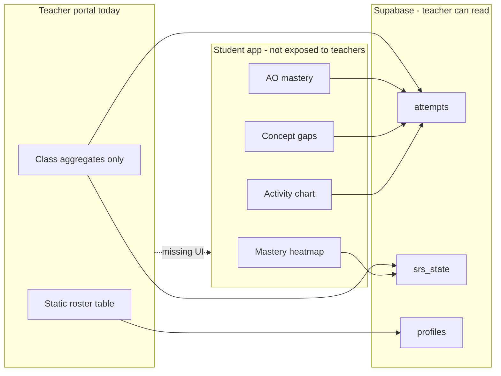
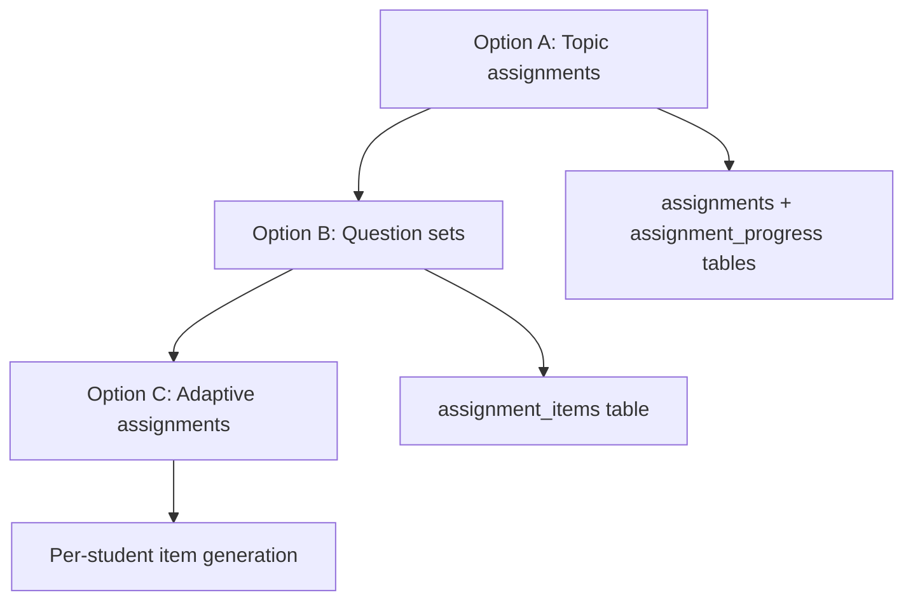
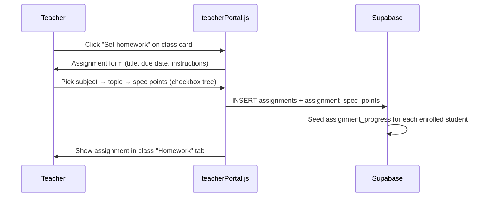
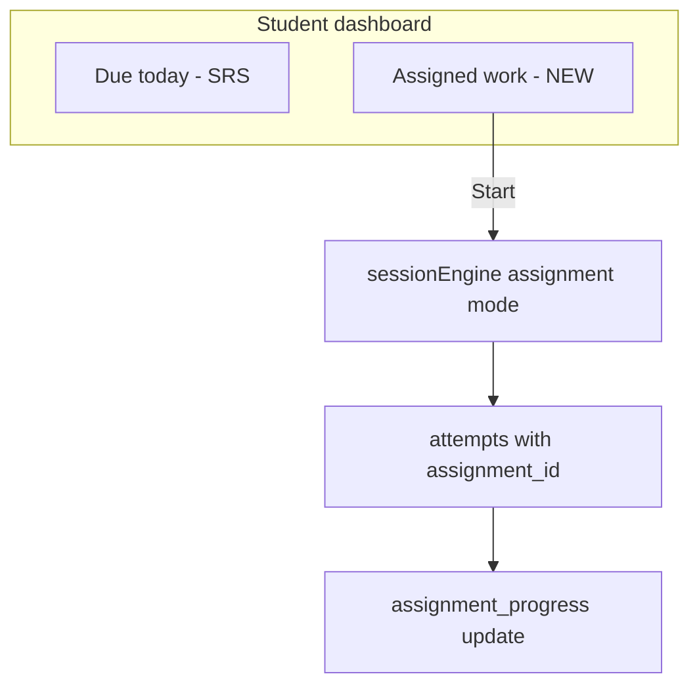
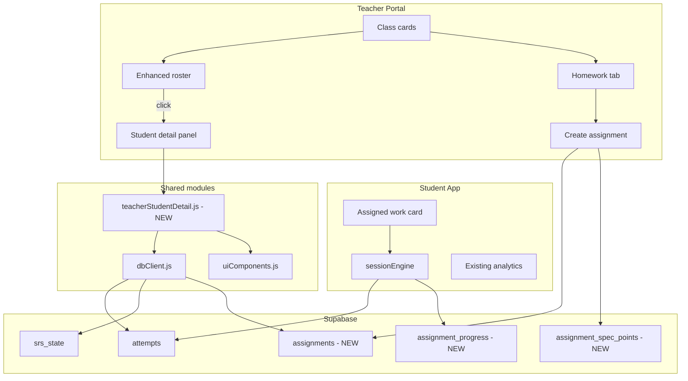

# Teacher dashboard enhancement plan

## Executive summary

The teacher portal today (`teacher.html` + `src/teacherPortal.js`) supports class creation, join codes, and a static roster with class-level aggregates. The student app already has rich progress analytics (mastery heatmap, AO breakdown, concept gaps, activity charts) backed by `attempts` and `srs_state`, and RLS already lets teachers **read** that data — but none of it is surfaced in the teacher UI.

This plan covers two major capabilities:

1. **Student drill-down** — clicking a roster row opens a detail view showing current progress, strengths, and weaknesses.
2. **Homework & tracking** — options for teachers to assign work to a class and monitor who has started, completed, and how they scored.

The recommended approach is phased: ship student drill-down first (high value, no new schema), then add a lightweight assignment model that reuses existing practice sessions rather than building a parallel homework engine.

---

## Current state

### What exists

| Layer | Status |
|-------|--------|
| Teacher auth & role enforcement | ✅ `teacherPortal.js`, `20250612_teacher_signup.sql` |
| Class CRUD (create + list) | ✅ Join code generation via `generate_join_code()` RPC |
| Student roster | ✅ Name, tier, plan, onboarded — **not clickable** |
| Class summary | ✅ Student count, blended avg score, SRS due/overdue counts |
| Teacher read access to student data | ✅ RLS on `profiles`, `attempts`, `srs_state` |
| Student progress analytics | ✅ Full stack in `app.js` + `uiComponents.js` + `dbClient.js` |
| Homework / assignments | ❌ No tables, UI, or flows |

### Key gap



### Roster rendering today (no interaction)

```244:264:src/teacherPortal.js
      rosterEl.innerHTML = `
        <table class="teacher-roster-table">
          <thead>
            <tr><th>Student</th><th>Tier</th><th>Plan</th><th>Onboarded</th></tr>
          </thead>
          <tbody>
            ${students
              .map(
                (s) => `
              <tr>
                <td>${escapeHtml(s.display_name?.trim() || "Unnamed student")}</td>
                ...
              </tr>
```

### Reusable student-side building blocks

| Function | File | Use in teacher view |
|----------|------|---------------------|
| `fetchUserSRSState(userId)` | `dbClient.js` | Heatmap state per student |
| `fetchAllSpecificationPoints()` | `dbClient.js` | Heatmap grid |
| `renderMasteryHeatmap(...)` | `uiComponents.js` | Visual progress (read-only, no cell click) |
| `fetchConceptGapAttempts(userId)` | `dbClient.js` | Weaknesses list |
| `fetchAttemptActivity(userId, sinceISO)` | `dbClient.js` | Recent activity chart |
| `fetchSyllabusPipelineData(...)` | `dbClient.js` | Subject/topic mastery % |
| `fetchWeeklyForecastSchedules(userId)` | `dbClient.js` | Upcoming revision load |

---

## Part 1: Student detail view (click roster → progress)

### Target experience

When a teacher clicks a student name in the roster:

1. A **slide-over panel** or **inline expanded row** opens (panel recommended — keeps class context visible).
2. Header shows student name, tier, onboarding status, last active date, current streak.
3. Three summary cards at top:
   - **Overall progress** — % spec points at mastery vs total in their tier
   - **Recent performance** — avg score % over last 30 days
   - **Revision health** — due today / overdue SRS items
4. **Strengths** section — top 5 spec points by mastery (high ease factor, stable intervals, strong recent scores).
5. **Weaknesses** section — active concept gaps (ease factor &lt; 2.0, lapses, or failed recent attempts) grouped by subject.
6. **Progress detail** tabs:
   - *Mastery map* — read-only heatmap (reuse `renderMasteryHeatmap`, disable `onCellClick`)
   - *Activity* — 30-day attempt chart (adapt `loadActivityChart` from `app.js`)
   - *AO breakdown* — AO1/AO2/AO3 bars (adapt student analytics)
   - *Topics* — subject mastery index table

### Strengths & weaknesses — derivation rules

No new “skills” table is needed. Derive from existing SRS + attempts data:

| Signal | Strength heuristic | Weakness heuristic |
|--------|-------------------|-------------------|
| SRS state | `ease_factor >= 2.5`, `repetitions >= 3`, `due_date` &gt; today + 7d | `ease_factor < 2.0` or `lapses >= 2` |
| Recent attempts | Last 3 attempts on spec point avg ≥ 80% | Last attempt &lt; 50% or `feedback_payload.missing` non-empty |
| Scheduling | Not due for 14+ days | `due_date < today` (overdue) |
| Never practised | — | In seeded SRS but `repetitions === 0` and due |

**Display format for teachers (plain language, not raw SRS jargon):**

- Strength: *"Cell structure (4.1.1) — consistently strong, last scored 5/6"*
- Weakness: *"Ionic bonding (5.1.2) — 2 failed attempts, review needed"*

### UI approach options

| Option | Pros | Cons | Recommendation |
|--------|------|------|------------------|
| **A. Slide-over panel** | Fast to build, no routing, keeps class visible | Limited space for heatmap on mobile | ✅ **Phase 1** |
| **B. Dedicated sub-page** (`teacher.html?student=uuid`) | Deep linking, bookmarkable | Needs URL state + back nav | Phase 2 |
| **C. Modal dialog** | Simple | Cramped for heatmap + charts | Not recommended |

### Roster enhancements (alongside drill-down)

Add per-student columns to the roster table so teachers see signal before clicking:

| New column | Source |
|------------|--------|
| Last active | `profiles.last_login_date` |
| Avg score (30d) | Aggregate `attempts` per `user_id` |
| Due / overdue | Count `srs_state` rows per student |
| Streak | `profiles.current_streak` |

Make rows visually scannable: highlight students with overdue &gt; 5 or avg score &lt; 50%.

### Implementation sketch

**New module:** `src/teacherStudentDetail.js`

```javascript
// Pseudocode — orchestrates existing dbClient + uiComponents
export async function openStudentDetail(studentId, classId, displayName) {
  const [srs, specPoints, gaps, activity, profile] = await Promise.all([
    fetchUserSRSState(studentId),
    fetchAllSpecificationPoints(),
    fetchConceptGapAttempts(studentId),
    fetchAttemptActivity(studentId, thirtyDaysAgoISO()),
    fetchStudentProfile(studentId),
  ]);
  const { strengths, weaknesses } = deriveStrengthsWeaknesses(srs, gaps, activity);
  renderStudentPanel({ displayName, profile, strengths, weaknesses, srs, specPoints, activity });
}
```

**Changes to existing files:**

| File | Change |
|------|--------|
| `teacher.html` | Add `#studentDetailPanel` shell (header, tabs, close button) |
| `teacherPortal.js` | Click handler on roster rows; import `openStudentDetail` |
| `dbClient.js` | Add `fetchStudentProfileForTeacher(userId)` (thin wrapper) |
| `styles.css` | Panel, tabs, strength/weakness list styles |
| `uiComponents.js` | Optional: `renderMasteryHeatmapReadOnly()` flag to disable clicks |

**No schema migration required** for Part 1.

---

## Part 2: Homework & assignment tracking

Homework does not exist today. Below are three design options, from simplest to most powerful.

### Option A — Topic-based assignments (recommended MVP)

Teachers pick **spec points** (or whole topics) and a **due date**. Students see assigned items in a new "Assigned work" section on their dashboard. Completion is tracked when the student finishes a practice session covering those spec points.

**Best for:** "Revise Cell Biology sections 4.1.1–4.1.3 by Friday"

| Pros | Cons |
|------|------|
| Aligns with existing SRS + spec_point practice mode | Doesn't pin exact questions |
| Simple teacher picker (subject → topic → spec points) | Student could practice off-assignment and still "complete" if spec overlaps |
| Reuses `sessionEngine` `spec_point` mode | |

### Option B — Question-set assignments

Teachers select explicit **questions** (or auto-generate a mini paper via `paperBuilder.js` logic) and assign as a fixed set.

**Best for:** "Complete this 20-mark paper by Monday"

| Pros | Cons |
|------|------|
| Precise control over content | More complex UI (question browser or paper builder for teachers) |
| Clear completion: N/N questions attempted | Larger schema (`assignment_items`) |
| Score reporting is unambiguous | |

### Option C — Smart / adaptive assignments

Teacher sets a goal ("Cover 5 spec points in Biology, ~30 marks total") and the system auto-selects questions based on class weakness data.

**Best for:** Differentiated homework — system picks weak areas per student

| Pros | Cons |
|------|------|
| Personalised per student | Hardest to build and explain to teachers |
| Leverages strengths/weaknesses from Part 1 | Completion criteria vary per student |
| Highest pedagogical value | Phase 3+ only |

### Recommended path: A → B → C



---

## Homework data model (Option A MVP)

### New tables

```sql
-- Core assignment
create table assignments (
  id uuid primary key default gen_random_uuid(),
  class_id uuid not null references classes(id) on delete cascade,
  teacher_id uuid not null references profiles(user_id) on delete cascade,
  title text not null,
  instructions text,
  due_at timestamptz not null,
  status text not null default 'active'
    check (status in ('draft', 'active', 'closed')),
  created_at timestamptz not null default now()
);

-- What to revise (spec points)
create table assignment_spec_points (
  assignment_id uuid not null references assignments(id) on delete cascade,
  spec_point_id uuid not null references spec_points(id) on delete cascade,
  primary key (assignment_id, spec_point_id)
);

-- Per-student progress
create table assignment_progress (
  assignment_id uuid not null references assignments(id) on delete cascade,
  user_id uuid not null references profiles(user_id) on delete cascade,
  status text not null default 'not_started'
    check (status in ('not_started', 'in_progress', 'completed', 'overdue')),
  completed_at timestamptz,
  score_pct numeric,           -- avg score on assignment-scoped attempts
  questions_attempted int default 0,
  questions_required int,      -- optional threshold (e.g. 3 questions per spec point)
  updated_at timestamptz not null default now(),
  primary key (assignment_id, user_id)
);
```

### Linking attempts to assignments (optional but valuable)

```sql
alter table attempts add column if not exists assignment_id uuid
  references assignments(id) on delete set null;
```

When a student starts an assignment-scoped session, pass `assignment_id` into attempt inserts in `app.js`. This lets teachers filter performance to **assigned work only** vs voluntary practice.

### RLS policies (sketch)

| Table | Teacher | Student |
|-------|---------|---------|
| `assignments` | CRUD own classes | SELECT where `class_id` matches enrolled class |
| `assignment_spec_points` | CRUD via assignment ownership | SELECT via assignment |
| `assignment_progress` | SELECT + UPDATE (e.g. extend deadline) | SELECT own row; UPSERT own progress |
| `attempts.assignment_id` | Read class attempts | Write own attempts |

### Completion rules (configurable per assignment)

| Rule | Definition | Default |
|------|------------|---------|
| **Attempt threshold** | Student attempts ≥ N questions across assigned spec points | 1 question per spec point |
| **Score threshold** | Avg score ≥ X% across assignment attempts | None (completion = attempted) |
| **Time bound** | `due_at` passed → status `overdue` | Required `due_at` |
| **SRS mastery** | Spec point reaches ease ≥ 2.5 | Off by default (too strict for homework) |

Progress updates via:

1. **Client-side** — after session end in `app.js`, call `update_assignment_progress` RPC
2. **Server-side trigger** — on `attempts` insert where `assignment_id` is set (more reliable)

Recommend **RPC** for v1: `upsert_assignment_progress(p_assignment_id, p_user_id)`.

---

## Homework UI flows

### Teacher: create assignment



**Spec point picker UI:**

- Reuse curriculum hierarchy from `spec_points` (subject / paper / topic_name / spec_ref)
- Filter by class majority tier (FT vs HT) — show only questions available for that tier
- "Select whole topic" shortcut
- Preview: estimated question count and mark total

### Teacher: track completion

New **Homework** tab on each class card:

| Column | Data |
|--------|------|
| Assignment title | `assignments.title` |
| Due | `due_at` (red if past) |
| Class completion | `completed / total` students |
| Avg score | Mean `score_pct` across `assignment_progress` |
| Actions | View detail, close assignment, extend deadline |

**Assignment detail view:**

```
┌─────────────────────────────────────────────────────────┐
│  Homework: Cell Biology revision          Due: Fri 14 Jun │
│  ████████████░░░░  8/12 students completed (67%)         │
├─────────────────────────────────────────────────────────┤
│  Student          Status        Score    Attempts  Due   │
│  Alice Smith      Completed     82%      6/6       ✓     │
│  Ben Jones        In progress   45%      3/6       ✓     │
│  Cara Lee         Not started   —        0/6       ⚠ overdue │
│  ...                                                      │
└─────────────────────────────────────────────────────────┘
```

Clicking a student row opens the Part 1 detail view, filtered to assignment-scoped attempts when `assignment_id` is set.

### Student: see and complete homework

Add to student dashboard (`index.html`):

1. **"Assigned work" card** above or beside "Due today" on Practice tab
2. Each assignment shows title, due date, progress bar, "Start" button
3. "Start" launches `sessionEngine` in a new mode: `assignment` — question pool restricted to `assignment_spec_points`, attempts tagged with `assignment_id`
4. On session end → update `assignment_progress` via RPC



---

## Homework options comparison matrix

| Criterion | Option A Topics | Option B Question sets | Option C Adaptive |
|-----------|----------------|----------------------|-------------------|
| Teacher effort to create | Low | Medium | Low (set goal only) |
| Student clarity | "Revise these topics" | "Answer these questions" | "Personalised pack" |
| Completion tracking | Good (with assignment_id on attempts) | Excellent | Complex |
| Reuses existing engine | ✅ spec_point mode | ✅ paperBuilder / random pool | Needs new selector |
| Schema complexity | Low | Medium | Medium |
| Time to ship | ~1 sprint | ~2 sprints | ~3+ sprints |

---

## Cross-cutting concerns

### Performance

- Class roster with per-student aggregates: batch query or single RPC `get_class_roster_stats(p_class_id)` instead of N+1 queries
- Student detail panel: lazy-load tabs (fetch activity chart only when tab opened)
- Large classes (30+ students): paginate roster; virtualise heatmap if needed

### Privacy & permissions

- Teachers only see students in their classes (existing RLS)
- Student detail view is read-only for teachers (no editing SRS, scores, or tier)
- Assignment data scoped to class enrollment
- Consider GDPR: display name only, no email in teacher views

### Accuracy fixes (existing bugs to address)

| Issue | Fix |
|-------|-----|
| Class avg score mixes all students' attempts into one pool | Compute per-student avg, then class mean |
| Due/overdue counts SRS rows not students | Report "12 items overdue across class" or "5 students with overdue items" |
| Last active not shown | Surface `last_login_date` on roster |

### Export (future)

- CSV export: roster + assignment completion matrix
- Printable assignment report for parents' evening

---

## Phased implementation roadmap

### Phase 1 — Student drill-down (no schema change)

| Task | Files |
|------|-------|
| Make roster rows clickable | `teacherPortal.js`, `styles.css` |
| Build slide-over panel shell | `teacher.html`, `styles.css` |
| Create `teacherStudentDetail.js` | New file |
| Implement strengths/weaknesses derivation | `teacherStudentDetail.js` |
| Wire read-only heatmap | `uiComponents.js`, `dbClient.js` |
| Add roster summary columns (last active, due, avg score) | `teacherPortal.js`, `dbClient.js` |
| Fix class summary aggregation | `teacherPortal.js` |

**Exit criteria:** Teacher can click any student and see progress, top strengths, top weaknesses, and mastery heatmap.

### Phase 2 — Homework MVP (Option A)

| Task | Files |
|------|-------|
| Supabase migration: assignments tables + RLS + RPCs | `supabase/migrations/` |
| Teacher: "Set homework" form + spec point picker | `teacherPortal.js`, `teacher.html` |
| Teacher: homework list + completion table per class | `teacherPortal.js` |
| Student: "Assigned work" card | `index.html`, `app.js` |
| Session engine: `assignment` mode | `sessionEngine.js`, `app.js` |
| Tag attempts with `assignment_id` | `app.js` |
| Progress update RPC | migration + `dbClient.js` |

**Exit criteria:** Teacher assigns topics with due date; students complete via app; teacher sees per-student completion status.

### Phase 3 — Question-set assignments (Option B)

| Task | Notes |
|------|-------|
| `assignment_items` table | Links to `questions.id` |
| Teacher question picker or "generate paper" | Reuse `paperBuilder.js` |
| Fixed-order session mode | Sequential question list |
| Per-question score breakdown in teacher view | |

### Phase 4 — Class intelligence (Option C + polish)

| Task | Notes |
|------|-------|
| Class-wide weakness report | "70% struggling on 4.2.1" |
| Adaptive assignment generator | Uses Part 1 weakness logic |
| Student detail deep link URL | `teacher.html?class=&student=` |
| CSV export | |
| Optional: email/push reminders for overdue | Requires notification infra |

---

## Architecture (target state)



---

## Open decisions for product review

1. **Panel vs sub-page** for student detail — panel recommended for v1; confirm mobile priority.
2. **Completion definition** — is "attempted once" enough, or require minimum score?
3. **Draft assignments** — allow save-as-draft before publishing to class?
4. **Closed assignments** — can students still practice assigned topics after due date (voluntary) but status stays overdue?
5. **Tier filtering** — should homework spec points auto-filter to FT/HT based on class majority or per-student tier?
6. **Notifications** — in-app only for v1, or email reminders for overdue?
7. **Multiple classes** — can one student be in multiple classes? (Currently `profiles.class_id` is single FK — one class per student today.)

---

## File change summary

| File | Phase 1 | Phase 2 |
|------|---------|---------|
| `teacher.html` | Panel shell, tab structure | Homework create form, homework list |
| `src/teacherPortal.js` | Click handlers, roster columns | Assignment CRUD, completion views |
| `src/teacherStudentDetail.js` | **New** — detail orchestration | Assignment-filtered view |
| `src/dbClient.js` | Teacher fetch helpers, roster stats RPC | Assignment queries |
| `src/uiComponents.js` | Read-only heatmap option | — |
| `src/app.js` | — | Assigned work card, assignment session |
| `src/sessionEngine.js` | — | `assignment` practice mode |
| `styles.css` | Panel, strengths/weaknesses | Homework forms, progress bars |
| `supabase/migrations/` | — | Assignments schema + RLS + RPCs |
| `index.html` | — | Assigned work section |

---

## Success metrics

| Metric | How to measure |
|--------|----------------|
| Teacher engagement | % of teachers opening student detail within 7 days of launch |
| Time to insight | &lt; 3 clicks from class list to student weakness list |
| Homework adoption | Assignments created per class per week |
| Completion rate | % of `assignment_progress` reaching `completed` before `due_at` |
| Student compliance | % of enrolled students attempting assigned work within 48h |

---

## Next step

Confirm phasing and open decisions above, then implement **Phase 1** on `feat/improve-teacher-dashboard`: clickable roster, student detail panel, and strengths/weaknesses derived from existing SRS and attempt data — no database migration required.
