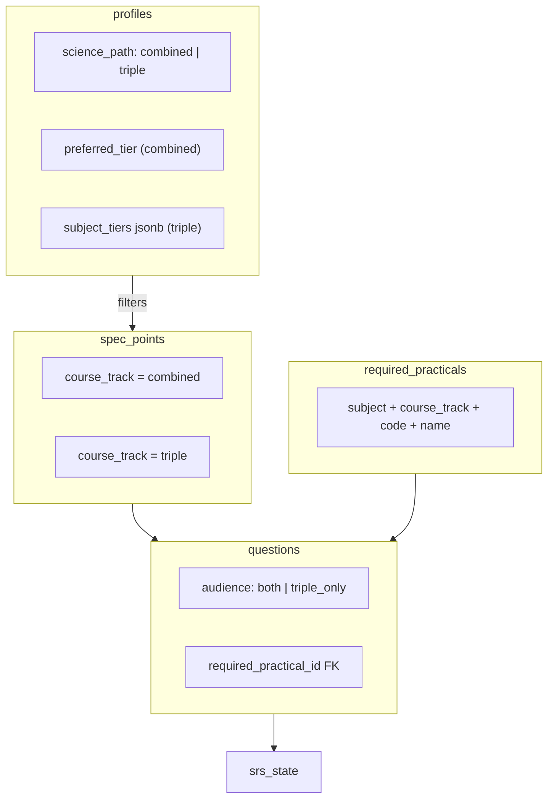

# Triple Science + Required Practicals Plan

**Last updated:** June 2026  
**Status:** Implemented in codebase — apply migration to Supabase before use.

## Scope

Two features to implement **before** populating the question bank at scale:

1. **Triple Science support** — Combined vs Triple path, per-subject tiers for triple students, syllabus track filtering
2. **Required Practicals catalog** — Code each AQA required practical; admin links RP questions to a specific practical

---

## Confirmed decisions

| Decision | Choice |
|----------|--------|
| Science path change in Settings | **Allowed** — unlikely in practice |
| SRS on path change | **Keep and migrate** mappable rows via equivalences; drop only orphan rows with no target-track equivalent (no full reset) |
| Question audience (admin) | **`both`** (default, shared content) or **`triple_only`** (triple-exclusive content only) — no separate `combined_only` |
| Required practical on questions | Keep **`is_required_practical`** checkbox; when checked, admin **must** pick a specific RP from a catalog dropdown |

---

## Current state

The app is hardcoded for **AQA Combined Science: Trilogy (8464)**:

- [`profiles`](supabase/migrations/20250612_onboarding.sql): single `preferred_tier` (FT/HT), no science-path field
- [`spec_points`](src/dbClient.js): `subject`, `paper`, `topic_name`, `spec_ref` — no track column
- [`questions`](src/sessionEngine.js): linked via `spec_point_id` + `tier`; boolean `is_required_practical` only ([`20250612_question_metadata.sql`](supabase/migrations/20250612_question_metadata.sql))
- Admin ([`admin.html`](admin.html) ~597): RP checkbox exists; no practical picker
- [`src/paperBuilder.js`](src/paperBuilder.js) / [`src/examRules.js`](src/examRules.js): RP = any question with `is_required_practical === true` (15% mark minimum)

Triple GCSEs use **separate specifications** (Biology 8461, Chemistry 8462, Physics 8463) with different spec refs and extra content (e.g. Space physics).



---

## Part A — Triple Science

### A1. Database schema

Create [`supabase/migrations/20250617_triple_science_and_rp.sql`](supabase/migrations/20250617_triple_science_and_rp.sql):

#### `profiles`

| Column | Type | Purpose |
|--------|------|---------|
| `science_path` | `text not null default 'combined'` | `'combined'` or `'triple'` |
| `subject_tiers` | `jsonb` | Triple: `{"biology":"FT","chemistry":"HT","physics":"FT"}` |

- Keep `preferred_tier` for combined students (backward compatible).
- Backfill existing users: `science_path = 'combined'`.

#### `spec_points`

| Column | Type | Purpose |
|--------|------|---------|
| `course_track` | `text not null default 'combined'` | `'combined'` or `'triple'` |

- Unique index on `(course_track, subject, paper, spec_ref)`.
- Existing rows default to `combined`.

#### `spec_point_equivalences` (required for SRS migration)

```sql
spec_point_equivalences (
  combined_spec_point_id uuid references spec_points(id),
  triple_spec_point_id uuid references spec_points(id),
  unique (combined_spec_point_id, triple_spec_point_id)
)
```

Maps shared curriculum nodes between 8464 and 8461/62/63 for dual-linked questions and SRS migration.

#### `questions`

| Column | Type | Purpose |
|--------|------|---------|
| `audience` | `text not null default 'both'` | `'both'` or `'triple_only'` |
| `triple_spec_point_id` | `uuid null references spec_points(id)` | Required when `audience = 'both'`: twin triple spec point |

**Linking rules:**

| audience | `spec_point_id` | `triple_spec_point_id` |
|----------|-----------------|------------------------|
| `both` (default) | combined spec point | matching triple spec point |
| `triple_only` | triple spec point | null |

- Backfill all existing questions to `audience = 'both'`; `triple_spec_point_id` populated later via equivalences during content import.
- Combined students never see `triple_only` questions.
- Triple students see `both` + `triple_only` on their track's spec points.

#### Update `seed_initial_srs()` RPC

- Filter `spec_points` by `course_track = profile.science_path`.
- Combined → `preferred_tier`; Triple → per-subject tier from `subject_tiers`.
- Question existence check uses subject-appropriate tier array and audience rules.

#### SRS migration on path change (not reset)

New RPC: `migrate_srs_for_track_change(p_new_path text)`:

1. For each `srs_state` row, resolve the spec point's `course_track`.
2. If already on target track → keep unchanged.
3. If switching **combined → triple**: look up `triple_spec_point_id` via `spec_point_equivalences`; if found, `UPDATE srs_state SET spec_point_id = …` (merge duplicate target rows if needed — keep higher `repetitions`, latest `due_date`).
4. If switching **triple → combined**: reverse via equivalences table.
5. **Orphans** (no equivalent, or `triple_only` spec with no combined counterpart): **delete** those `srs_state` rows only — everything mappable is preserved.
6. Optionally seed a small number of new starter topics on the **new** track if the migrated schedule is empty (reuse existing seed logic, idempotent).

Settings UI: brief confirmation (“Your schedule will be adjusted to match your new science path”) — **no** “you will lose all progress” wording.

Tier-only changes (same `science_path`): **no SRS migration** — only question filtering changes.

---

### A2. Shared helpers — `src/sciencePath.js`

```javascript
getSciencePath(profile)              // 'combined' | 'triple'
getTierForSubject(profile, subject)  // FT | HT
formatSciencePathLabel(profile)      // "Combined · FT" | "Triple · Bio FT · Chem HT · Phys FT"
targetTiersForProfile(profile, subject)
courseTrackForProfile(profile)
questionMatchesStudent(q, profile, specPoint)  // audience + track check
resolveSpecPointForTrack(q, profile)           // spec_point_id vs triple_spec_point_id for SRS
```

Thread through [`src/dbClient.js`](src/dbClient.js), [`src/onboardingEngine.js`](src/onboardingEngine.js), [`src/sessionEngine.js`](src/sessionEngine.js), [`src/app.js`](src/app.js), [`src/uiComponents.js`](src/uiComponents.js), teacher views.

---

### A3. Onboarding (6 steps)

| Step | Combined | Triple |
|------|----------|--------|
| 1 — Science path | Combined or Triple | Same |
| 2 — Tier(s) | Single FT/HT | Per-subject FT/HT × 3 |
| 3 — Study order | Unchanged | Unchanged |
| 4 — Difficulty | Unchanged | Unchanged |
| 5 — Class code | Unchanged | Unchanged |
| 6 — Summary | Path + tiers + rankings | Same |

First post-register step (not on auth signup form).

---

### A4. Settings + dashboard header

- Settings: science path toggle + dynamic tier UI (same as onboarding).
- On path change: call `migrate_srs_for_track_change()`; reload dashboard.
- Header: `#sciencePathChip` next to streak/XP; triple students sync `#tierFilter` to current `#subjectFilter` subject tier.

---

### A5. Admin authoring (triple)

- Course track filter on Creator / CSV / Audit.
- **Audience** dropdown: **Both** (default) | **Triple only**.
- When **Both**: dual spec linking (combined `spec_point_id` + `triple_spec_point_id`), auto-fill from equivalences where possible.
- CSV: optional `audience`, `triple_spec_ref` columns.
- Audit badges: audience + dual-link completeness.

---

### A6. Equation sheets

Add `course_track` to [`equation_sheets`](supabase/migrations/20250615_calculation_workflow.sql) (8464 combined vs 8463 triple physics). Filter in [`src/calculationWorkflow.js`](src/calculationWorkflow.js).

---

## Part B — Required Practicals catalog

### B1. Rationale

Today `is_required_practical` is a boolean used by [`src/paperBuilder.js`](src/paperBuilder.js) for the 15% RP mark target ([`RP_MIN_PCT`](src/examRules.js)). That remains sufficient for paper assembly, but authoring and future analytics need **which** practical each question assesses.

### B2. Database

Same migration file — new reference table:

```sql
create table required_practicals (
  id uuid primary key default gen_random_uuid(),
  subject text not null check (subject in ('biology', 'chemistry', 'physics')),
  course_track text not null default 'both'
    check (course_track in ('combined', 'triple', 'both')),
  code text not null,           -- e.g. 'RP1'
  title text not null,          -- e.g. 'Food tests'
  description text,             -- optional short admin note
  sort_order smallint not null default 0,
  unique (subject, course_track, code)
);
```

On **`questions`**:

```sql
alter table questions
  add column required_practical_id uuid references required_practicals(id);

-- App constraint: required_practical_id IS NOT NULL implies is_required_practical = true
-- (enforce in admin save validation; optional DB check)
```

Keep **`is_required_practical`** for fast paper-builder checks and audit flags (`M/RP` in admin list). On save:

- Checkbox **off** → `is_required_practical = false`, `required_practical_id = null`
- Checkbox **on** → `is_required_practical = true`, `required_practical_id` **required**

### B3. Seed data

Add [`data/required_practicals/aqa_combined_trilogy.json`](data/required_practicals/aqa_combined_trilogy.json) and triple variants (or one file with `course_track` per entry). Migration or seed script inserts rows.

**Combined Trilogy (8464) — illustrative structure:**

| Subject | Code | Title (AQA) |
|---------|------|-------------|
| Biology | RP1 | Use of microscopes… |
| Biology | RP2 | Food tests |
| … | … | … |
| Chemistry | RP1 | … |
| Physics | RP1 | … |

Exact titles taken from official AQA RP activity list at import time. Triple (8461/62/63) lists may differ slightly — use `course_track = 'triple'` or `'both'` where an RP is shared.

### B4. Admin UI

Extend [`admin.html`](admin.html) creator + edit panels (after RP checkbox ~597):

```html
<div id="requiredPracticalRow" class="hidden">
  <label for="requiredPracticalSelect">Required practical</label>
  <select id="requiredPracticalSelect">
    <option value="">Select practical…</option>
  </select>
</div>
```

Behaviour ([`src/adminMetadata.js`](src/adminMetadata.js)):

- `#chkRequiredPractical` change → show/hide row; load options filtered by current **subject** + **course track** (combined/triple from form track filter).
- Save validation: if RP checked and no practical selected → block save with message.
- Edit panel: same pattern (`editChkRequiredPractical`, `editRequiredPracticalSelect`).
- Audit list: extend flags from `M/RP` to `M/RP3` (show code) when `required_practical_id` set.

CSV import: optional column `required_practical_code` (resolved per subject + track).

### B5. Student app (minimal this phase)

- Include `required_practical_id` (+ joined `required_practicals(code, title)`) in `QUESTION_SELECT` for future use.
- **No student-facing RP filter yet** — paper builder continues using `is_required_practical` boolean for 15% target.
- Future: RP coverage dashboard, “practice this practical” filter — out of scope now but schema supports it.

### B6. Paper builder

No algorithm change required initially — `isRpQuestion()` in [`src/examRules.js`](src/examRules.js) unchanged.

Optional later enhancement: ensure paper spans N distinct `required_practical_id` values (not in this phase).

---

## Content population order (after code ships)

1. Import triple `spec_points` (`course_track = 'triple'`)
2. Seed `required_practicals` rows (combined + triple)
3. Populate `spec_point_equivalences` for shared nodes
4. Author questions:
   - Shared → `audience = 'both'` + dual spec links
   - Triple-only (e.g. Space physics) → `audience = 'triple_only'`
   - RP questions → checkbox + specific practical
5. Backfill existing combined questions: `audience = 'both'`, link triple twins when equivalences exist

---

## Testing checklist

- Combined student: behaviour unchanged after backfill
- Triple onboarding: per-subject tiers; SRS seeds triple syllabus only
- Settings path change: SRS rows **migrated** (not wiped); orphans removed only
- Tier change same path: SRS untouched
- Admin: `both` vs `triple_only`; RP checkbox + practical picker validation
- Paper builder: 15% RP target still works via boolean flag
- Teacher portal: science path + tiers visible

---

## Files to touch

| Area | Files |
|------|-------|
| Migration | `supabase/migrations/20250617_triple_science_and_rp.sql`, seed JSON under `data/required_practicals/` |
| Science path | `src/sciencePath.js` (new), `src/onboardingEngine.js`, `src/dbClient.js`, `src/sessionEngine.js`, `src/app.js`, `src/uiComponents.js` |
| Required practicals | `admin.html`, `src/adminMetadata.js`, `src/examRules.js` (guidelines text), `src/sessionEngine.js` (select string) |
| Teacher | `src/teacherPortal.js`, `src/teacherStudentDetail.js` |
| Equation sheets | `src/calculationWorkflow.js`, equation sheet migration |

---

## Out of scope

- Populating triple spec_points / bulk questions (follows after schema)
- Student-facing RP practice filters or RP analytics dashboard
- Landing page rebrand ([`index.html`](index.html))

---

## Implementation todos

1. Migration: profiles, spec_points, questions audience, equivalences, required_practicals, migrate_srs RPC, seed_initial_srs update
2. `src/sciencePath.js` + content filtering across student app
3. Onboarding (6 steps) + settings + dashboard header chip
4. Admin: course track, audience (both/triple_only), dual spec linking
5. Admin: RP catalog dropdown + validation + CSV column
6. Equation sheets course_track
7. Teacher portal path/tier display
