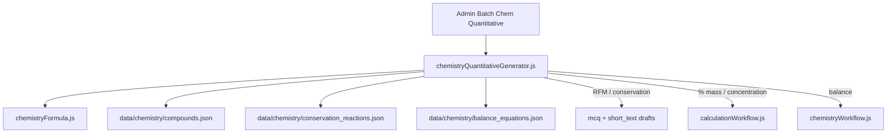

# Chemistry quantitative batch generators

## Decisions locked in

| Scenario | Student format | Marking |
|----------|----------------|---------|
| Relative formula mass | MCQ + short_text (same stem/data) | 1 mark; MCQ Low FT / short_text Standard FT; MS1a, WS4.3 |
| Conservation of mass | MCQ + short_text (word + symbol equations) | 1 mark; MCQ Low FT, short_text Standard FT; MS1a, WS4.3 |
| Percentage by mass | Multi-step `numeric` (no equation sheet) | 3 marks: element mass → ratio → %; ECF on later steps; MS1a, MS1c, WS4.3 |
| Concentration (find c) | Multi-step `numeric` (no equation sheet) | Std 4–5; MS1a, MS1c, MS3c |
| Concentration (find mass) | Multi-step `numeric` (no equation sheet) | Std 4–5; MS1a, MS1c, MS3c, MS3b |
| Balancing equations | Keep interactive balancer (`balance_equation`) | WS4.3; ionic/half HT-only (Std 4–5) |

**Hard rule:** Do **not** create chemistry (or biology) equation sheets. Chemistry students recall equations; Batch Numeric / sheet recall stays physics-only.

HT mole calculations are out of scope for this pass.

## Architecture



New Admin panel **Batch Chemistry Quantitative** (alongside Batch Numeric), with a scenario selector. All chemistry numeric drafts are built by the chem generator with custom `calculation_config` — **not** via `numericQuestionGenerator` / equation sheets.

## Shared foundations

### Formula utilities — new [`src/chemistryFormula.js`](src/chemistryFormula.js)

- Parse formulas **without brackets** (`H2O`, `CaCO3`, `NH4NO3`, `Na2SO4`).
- Compute Mr from Ar using shared GCSE Ar table (extract/`export` from [`ELEMENT_DATA`](src/chemistryWorkflow.js) `A` values, including Cl = 35.5).
- Helpers: `elementMassInCompound(formula, element)`, `percentByMass(formula, element)`, distractor Mr variants (omit multiplier, wrong Ar, off-by-one atom count).

### Curated data

- [`data/chemistry/compounds.json`](data/chemistry/compounds.json) — ~25–30 FT compounds, no brackets; each: `formula`, `name`, optional `focus_elements` for % mass.
- [`data/chemistry/conservation_reactions.json`](data/chemistry/conservation_reactions.json) — word + symbol forms, species list, which masses can be the unknown.
- [`data/chemistry/balance_equations.json`](data/chemistry/balance_equations.json) — symbol / ionic / half templates + correct coeffs (expand beyond H₂+O₂→H₂O).

### Generator module — new [`src/chemistryQuantitativeGenerator.js`](src/chemistryQuantitativeGenerator.js)

`generateChemBatch(spec)` → drafts with shared seed/PRNG pattern from [`numericQuestionGenerator.js`](src/numericQuestionGenerator.js). Spec shape: `{ scenario, count, seed, tier, paper, courseTrack, audience, spec_point_id, ...scenarioOptions }`.

---

## 1) Relative formula mass (MCQ + short_text)

For each compound:

- Prompt: “Calculate the relative formula mass of …” with Ar values given in the stem (or a standard Ar table reference).
- **MCQ**: correct Mr + 3 distractors from formula mistakes (e.g. Na₂O: 39+16, 23+16, 46+32).
- **short_text**: same prompt; `key_type: "keywords"` with required string of the number (same pattern as electron-structure short_text seeds), or a numeric-tolerant keyword payload if the app already accepts decimal strings (Cl compounds → 35.5).
- Demand: MCQ `low` (Low FT); short_text `standard` (Standard FT); `is_maths_skill: true`; link to C5.3.1 / quantitative chem spec points when selected in admin.

Admin: generate N compounds → preview pairs → edit → commit both types.

---

## 2) Conservation of mass (MCQ + short_text)

From reaction bank + randomized nice masses that conserve:

- Unknown = one reactant or product mass; others given.
- Stem variants: **word equation** and **symbol equation** (batch recipes can request either or both).
- Correct answer = missing mass from conservation.
- MCQ distractors: sum all given, difference of wrong pair, ignore one substance, arithmetic slip.
- Parallel short_text with same numbers/equation.

---

## 3) Percentage by mass (multi-step numeric)

Custom 3-step `calculation_config` (no sheet):

| Step | Type | Marks | Student enters |
|------|------|-------|----------------|
| 1 | `element_mass` | 1 | Mass of focus element in the formula (e.g. O in NH₄NO₃ → 48) |
| 2 | `mass_ratio` | 1 | Values as element_mass / Mr (e.g. 48/80) — structured like substitution slots |
| 3 | `calculate` | 1 | Final % |

**ECF**: wrong element mass (16 instead of 48) but then 16/80 and 20% → marks 2+3 only → **2/3**.

Extend [`calculationWorkflow.js`](src/calculationWorkflow.js): render/wire/mark `element_mass` and `mass_ratio`; ECF from wrong step-1 into later steps. Prompt gives compound, focus element, Ar values, and Mr.

---

## 4) Concentration — multi-path numeric (no equation sheets)

### Why not Batch Numeric / sheets

Physics batch numerics assume one equation from a sheet, optional unit conversion, then substitute/calculate. Concentration at GCSE has **several fully valid 3-mark routes** to the same answer. Locking students to one scaffold would under-credit correct alternative methods.

### Example (3.2 g in 50 cm³ → g/dm³)

| Path | Step 1 (1 mark) | Step 2 (1 mark) | Step 3 (1 mark) |
|------|-----------------|-----------------|-----------------|
| **Convert volume first** | 50/1000 (or setup) | 0.05 dm³ | 3.2 / 0.05 = **64** |
| **A** mass/vol then ×1000 | 3.2/50 | 0.064 | ×1000 = **64** |
| **B** scale factor | 1000/50 | 20 | ×3.2 = **64** |

### AQA answer-led marking (primary)

From the AQA mark scheme for this style of question:

- **Correct final answer (64)** → **3 marks** (working not required).
- **Listed near-miss answers** → **2 marks**, e.g. `0.16` / `0.064` / `0.64` / `6.4` / `6.4 × 10⁻⁵` (g/dm³). These are typical power-of-10 / missed-×1000 / inverted-conversion errors that still show substantial correct method.

So marking is **answer-led first**, not “answer alone = 1 mark”.

### Recommended approach: answer bands + multi-path working fallback

```js
calculation_config: {
  marking_mode: "multi_path",
  equation_given: false,  // recall; no sheet
  unit: "g/dm³",
  max_marks: 3,
  // Answer bands evaluated on the final-answer box (AQA-style)
  answer_bands: [
    { marks: 3, accept: [{ value: 64 }] },
    { marks: 2, accept: [
      { value: 0.16 }, { value: 0.064 }, { value: 0.64 },
      { value: 6.4 }, { value: 6.4e-5 }
    ]}
  ],
  // Working paths used when the final answer is not in a band (or to explain ECF feedback)
  paths: [
    {
      id: "convert_volume",
      label: "Convert volume to dm³, then c = m/V",
      steps: [
        { id: "s1", marks: 1, accept: [{ op: "div", values: [50, 1000] }, { value: 0.05 }] },
        { id: "s2", marks: 1, accept: [{ value: 0.05 }], ecf_from: "s1" },
        { id: "s3", marks: 1, accept: [{ value: 64 }], ecf_from: "s2" }
      ]
    },
    {
      id: "per_cm3_then_scale",
      label: "m/V in cm³, then ×1000",
      steps: [
        { id: "s1", marks: 1, accept: [{ op: "div", values: [3.2, 50] }, { value: 0.064 }] },
        { id: "s2", marks: 1, accept: [{ value: 0.064 }], ecf_from: "s1" },
        { id: "s3", marks: 1, accept: [{ value: 64 }], ecf_from: "s2" }
      ]
    },
    {
      id: "scale_factor",
      label: "1000/V then × mass",
      steps: [
        { id: "s1", marks: 1, accept: [{ op: "div", values: [1000, 50] }, { value: 20 }] },
        { id: "s2", marks: 1, accept: [{ value: 20 }], ecf_from: "s1" },
        { id: "s3", marks: 1, accept: [{ value: 64 }], ecf_from: "s2" }
      ]
    }
  ],
  answer: 64
}
```

**Marking algorithm:**

1. **Answer bands first** (final-answer box only): match → award that band’s marks (3 or 2). Stop if 3.
2. Else score each **working path** independently (ordered steps; ECF within that path only).
3. Award `max(answer_band_marks, best_path_marks)` — never sum paths or band + path.
4. Correct answer always wins full marks even if working is blank or follows a different method.

**Generator responsibility for near-miss band:** for each item, derive the standard AQA-style wrong answers from the given mass/volume (missed ×1000, ÷1000 instead of ×, wrong power of 10, etc.), not a hard-coded list only for 3.2/50.

**Student UI (v1):** final answer prominent; two optional method-neutral working boxes for when the answer is wrong and not in the 2-mark band (so path matching can still award 1–2 method marks). Labels stay method-neutral. No equation picker / sheet.

### Concentration rearrangement — find mass (in scope)

AQA: students should be able to **calculate the mass of solute in a given volume of solution of known concentration** (mass per given volume).

Batch recipes therefore include two concentration variants:

| Recipe | Given | Find | Unit |
|--------|-------|------|------|
| `concentration_find_c` | mass (g), volume (cm³ or dm³) | concentration | g/dm³ |
| `concentration_find_m` | concentration (g/dm³), volume (cm³ or dm³) | mass of solute | g |

Same infrastructure: `answer_bands` + `paths`, no equation sheet. Example paths for find-mass (e.g. 64 g/dm³ in 50 cm³ → 3.2 g):

| Path | Step 1 | Step 2 | Step 3 |
|------|--------|--------|--------|
| **Convert volume first** | 50/1000 → 0.05 dm³ | m = c × V → 64 × 0.05 | **3.2 g** |
| **Scale factor** | 50/1000 or 1000/50 | proportion of 1 dm³ | **3.2 g** |
| **cm³ form** | V in cm³ / 1000 | c × (V/1000) | **3.2 g** |

Answer-led marking mirrors find-c: correct mass → full marks; generator-derived near-misses (wrong power of 10 / missed conversion) → 2 marks where AQA-style; else best working path.

Admin concentration controls: recipe toggles for find-c and/or find-m counts; volume given in cm³ by default (conversion in paths).

**What we deliberately avoid:**

- Chemistry rows in `data/equation_sheets/`
- Extending `resolveEquationSheetId` for chemistry
- Routing concentration through Batch Numeric / `generateBatch`

**Optional later polish (not required for first pass):** expression matching for step 1 (`50/1000` as text) in addition to decimal intermediates; show one “model method” on the flashcard while still marking all paths.

---

## 5) Balancing equations (keep UI, remove from Diagram)

**Student experience unchanged**: `chemistry_interactive` + `kind: "balance_equation"` in [`chemistryWorkflow.js`](src/chemistryWorkflow.js).

**Authoring:** batch from `balance_equations.json` → drafts with prompts, `chemistry_config`, chemistry answer key (symbol / ionic / half).

**Remove from Chemistry Diagram panel** ([`admin.html`](admin.html)):

- Drop `balance_equation` from create/edit kind selects.
- Hide/remove `#chemEqFields` / edit equivalents and balance presets from diagram preset lists.
- Rename **"Chemistry Diagram / Equation"** → **"Chemistry Diagram"** in [`uiComponents.js`](src/uiComponents.js), [`app.html`](app.html), [`app.js`](src/app.js), admin.
- Keep runtime render/mark for `balance_equation` so existing and batch-created questions still work.

---

## Admin UX

New panel `#panelBatchChemQuant`:

- Scenario: RFM | Conservation | % by mass | Concentration (find c / find mass) | Balance equation
- Shared: subject chemistry, paper, tier, track, audience, seed, count, spec-point link
- Scenario-specific controls (compound count, word vs symbol, focus element, concentration recipe counts + mass/volume/c ranges, balance subtype filter)
- Preview table → inline edit → commit to Supabase + generation log source `batch_chem_quant`

---

## Tests

- [`tests/chemistryFormula.test.js`](tests/chemistryFormula.test.js) — parse, Mr, % mass, reject brackets.
- RFM distractors; conservation mass arithmetic; % mass ECF (16/80 → 2/3).
- Concentration find-c: correct answer alone → 3/3; listed near-miss alone → 2/3; working paths as fallback; take max(band, path).
- Concentration find-m: same bands+paths model for mass of solute from c and V (including cm³→dm³ in paths).
- Balancing batch draft shape; diagram admin no longer lists balance kind.
- Keep existing balance mark tests in [`tests/chemistryWorkflow.test.js`](tests/chemistryWorkflow.test.js).

## Out of scope (later HT pass)

Moles, reacting masses, atom economy, gas volumes, titration — scenario enum reserved / comment only.
