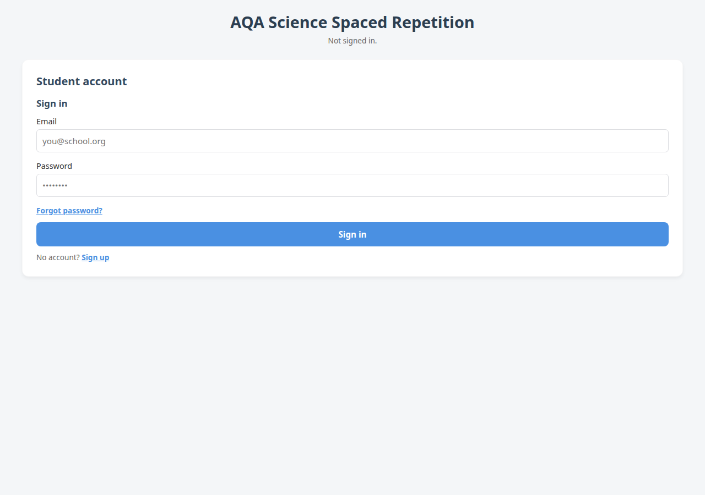
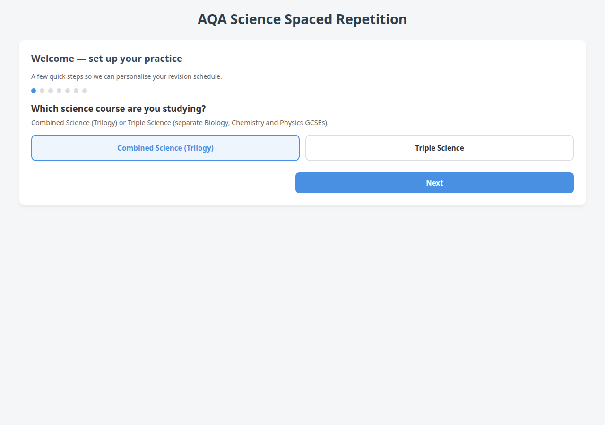
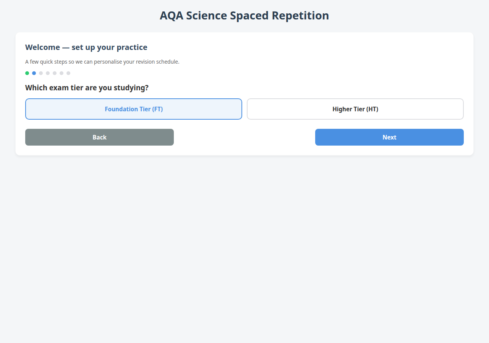
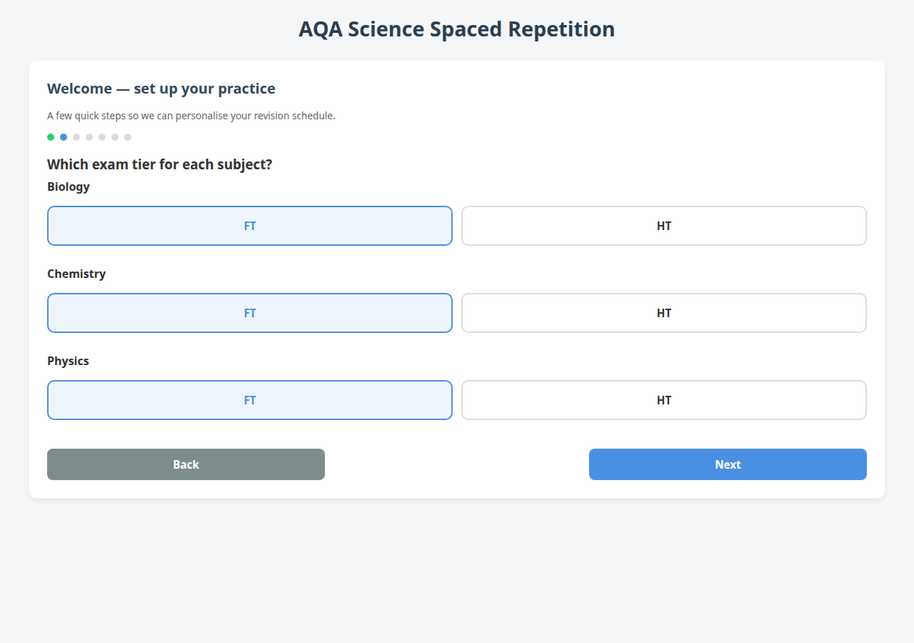
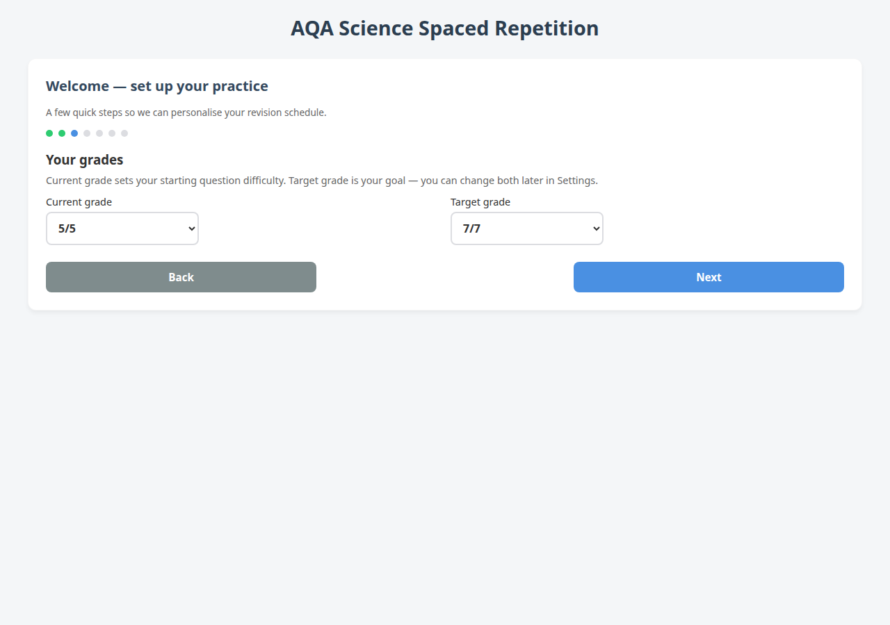
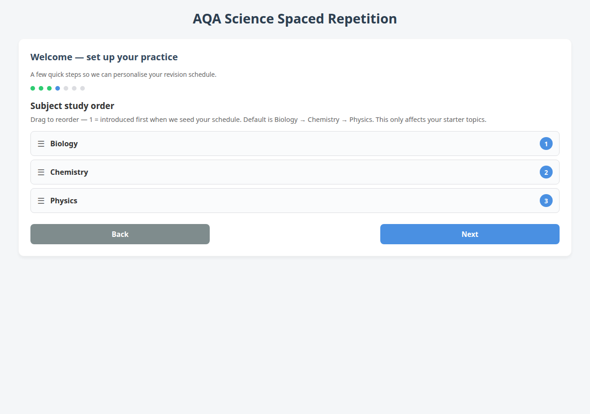
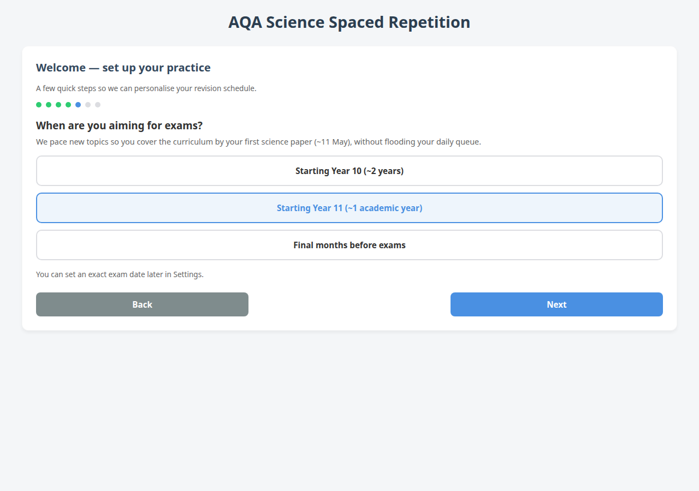
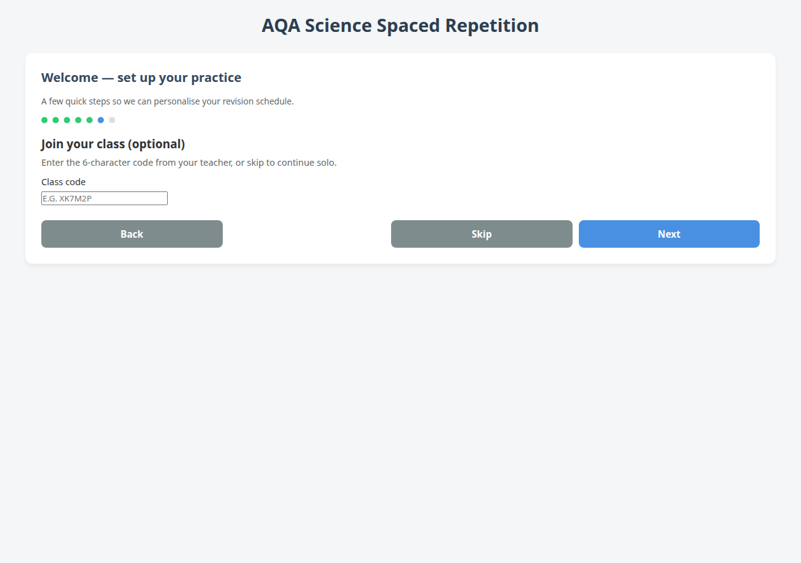
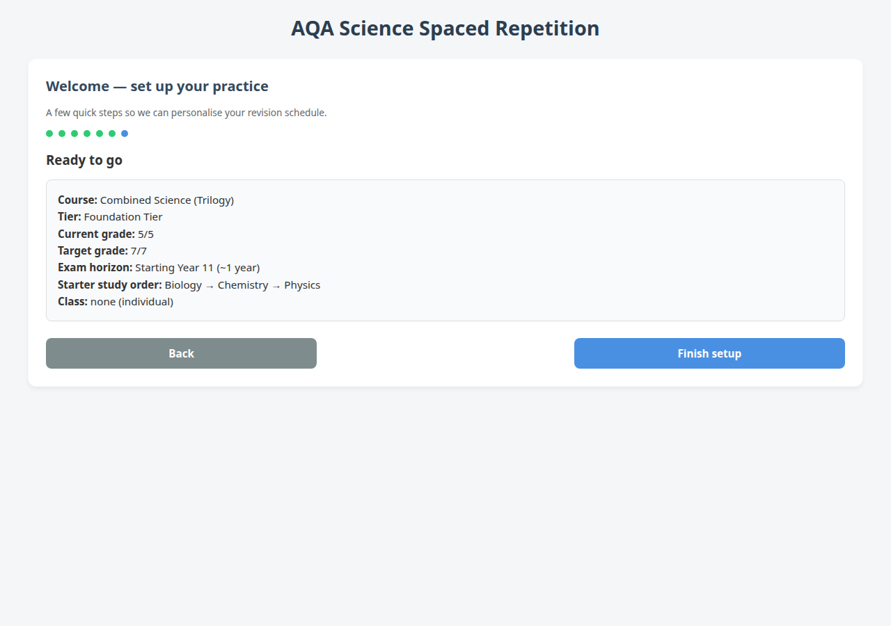

# Onboarding screenshots

Student sign-up and 7-step onboarding wizard (`app.html`).

| Step | Screenshot |
|------|------------|
| Sign up |  |
| 1 — Science course |  |
| 2 — Exam tier (Combined) |  |
| 2 — Exam tier (Triple) |  |
| 3 — Grades |  |
| 4 — Subject order |  |
| 5 — Exam horizon |  |
| 6 — Join class |  |
| 7 — Summary |  |
