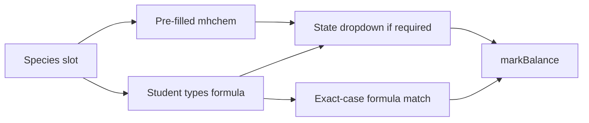

# Equation balancer: case-sensitive formulas and state symbols

Typed short-text / pick-n / checkpoint marking is **out of scope** for this change. Word those questions so they do not depend on typed `(s)` or formula case. That work can be added later.

## How the balancer works today

In [`src/chemistryWorkflow.js`](src/chemistryWorkflow.js), `balance_equation` questions:

- Author species as `H2:left, O2:left, H2O:right`
- Students only type **coefficients**
- Formulas are display-only mhchem (`$\ce{H2}$`)
- `markBalance` compares GCD-normalised coeffs (and extra half-equation species as exact `side:formula:coeff` strings)

Students never enter a formula or a state symbol, so `NaCl` vs `nacl` and `(s)` vs `(S)` cannot be tested.

## Target behaviour

Author can **pre-fill** a formula (display only) or leave a **blank slot** for the student to type. When any species has a state, **every** species gets a `(s)` / `(l)` / `(g)` / `(aq)` dropdown.

- Typed formula: **exact case** — `NaCl` matches `NaCl`; `nacl` / `NACL` fail; `CO` does not match `Co`
- State dropdown: only lowercase options; blank or wrong state fails the state mark
- Pre-filled formula: student does not type it; still picks a state when states are required
- Existing questions with no states and no blank slots: unchanged (coeff-only)



## Authoring syntax

Keep the single species line in [`admin.html`](admin.html) (`ChemEqSpecies` / `editChemEqSpecies`). Extend it:

- `H2(g):left` — show `H2`, expected state `g`
- `?NaCl(aq):left` — blank input; student must type `NaCl` (case-sensitive); expected state `aq`
- `H2:left` — show `H2`, no states on the question (legacy)

`?` prefix means the student types the formula. Trailing `(s|l|g|aq)` is the expected state and is stripped from the stored formula.

Stored species shape:

```js
{ formula: "NaCl", side: "left", state: "aq", studentEntersFormula: true }
```

If **any** species has a `state`, treat the question as requiring states on **all** species. Authors should set a state on every term.

Round-trip in `buildChemistryConfigFromForm` and edit populate: emit `?NaCl(aq):left` when `studentEntersFormula` is set.

Help text on the species field should show the three forms above.

## Student UI

In `renderBalanceEquation`:

- Pre-filled: current mhchem span
- Blank: short text input (`data-formula-idx`), `spellcheck="false"`, `autocapitalize="off"` so case is not “corrected”
- If any species has `state`: compact select after every term — `—` / `(s)` / `(l)` / `(g)` / `(aq)`
- Half-equation extra species: same state select when the question requires states; extra **token chips stay as now** (exact formula strings). If an extra species is student-added, its formula is already exact from the chip

Live state additions:

- `formulas: []` — student-typed values, aligned to species index (empty string for pre-filled slots)
- `states: []` — `"s"|"l"|"g"|"aq"|""`

Wire `input`/`change` like existing coeff handlers. `collectChemistryResponse` already clones live state, so the new fields ride along.

Initial state: `formulas` all `""`, `states` all `""`, coeffs still default to `1`.

## Marking

Update `markBalance` in [`src/chemistryWorkflow.js`](src/chemistryWorkflow.js):

1. **Coeffs** — existing GCD-normalised compare
2. **Formulas** — for each `studentEntersFormula` species, `trim` student text and compare with `===` to `species.formula` (no `toLowerCase`). Pre-filled species skip this check
3. **States** — if any expected state is set, every student state must equal the expected lowercase letter/code. Extra species states compared the same way when present on the mark scheme

Scoring:

- Dimensions not in play count as passed (legacy water balance still 1 mark for coeffs only)
- `max_marks === 1`: all in-play dimensions must pass
- `max_marks >= 2`: one mark per in-play dimension (coeffs, formulas, states), capped at `max_marks`. Wrong case on a typed formula fails the formula mark only; wrong/missing state fails the state mark only

Feedback strings should say when the formula case is wrong vs the state symbol is wrong (e.g. “Check chemical formula case (Co is cobalt, CO is carbon monoxide)” / “State symbols must be lowercase (s), (l), (g), (aq)”).

Model-answer caption for balance questions should show formulas + states, not only coeffs.

## Admin preset

Add a preset (do not change existing `water_balance`):

- Example: `2H2(g) + O2(g) → 2H2O(l)` with states, formulas pre-filled
- Optional second example with a blank slot, e.g. `?NaCl(aq):right`, to exercise case-sensitive typing

## Tests

[`tests/chemistryWorkflow.test.js`](tests/chemistryWorkflow.test.js) only (no short-text tests):

- Legacy `water_balance` still awards equivalent multiples, no states required
- Correct lowercase states + coeffs → full marks
- Blank/wrong state with correct coeffs → state mark lost
- Blank formula `NaCl` matches; `nacl` / `NACL` fail
- `CO` does not match `Co`
- 2-mark question: right coeffs + wrong state → 1 mark
- Species parse/round-trip: `?NaCl(aq):left` → `{ formula: "NaCl", state: "aq", studentEntersFormula: true }`

## Out of scope

- Short-text / pick-n / Section 3 keyword case rules
- Physics structured substitution (`I` ≡ `i`)
- AI long-answer examiner
- Free-typing extra half-equation species (chips remain)
