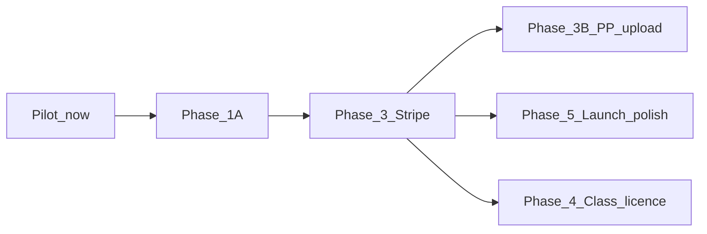

# Production Rollout Plan

**Last updated:** June 2026

## Executive summary

**Nothing needs implementing right now** for continued pilot testing. The app is in good shape: migrations applied, Phase 2 gates working, performance at Lighthouse ~83, admin **Pilot Pro Access** available for manual upgrades.

**Pre-public rollout** requires Phase 1A (domain/hosting), Stripe subscription + trial (Phase 3), legal/compliance polish (Phase 5), and PP bulk-upload admin (Phase 3B). Class licence billing stays **Phase 4**.

Explicitly **deferred** (no action): Supabase analytics views/RPCs; Tier 3 perf polish unless targeting 90+; Vite build until Phase 1A.

---

## Decisions confirmed

| Decision | Choice |
| -------- | ------ |
| **Pricing model** | **Paid subscription with 7-day free trial** — not permanent freemium |
| **Trial behaviour** | Full access during 7 days; **hard paywall** after trial if no payment |
| **Individual pricing** | **£15/year** early adopters · **£20/year** standard (annual only at launch) |
| **School PP access** | Schools email PP student list → **developer admin bulk upload** → comped access (no charge) |
| **Class licence** | **Retained** — teacher/school pays → enrolled students get access (Phase 4) |
| **Product name** | **TBD** (blocks Stripe branding + legal pages) |
| **Domain / hosting** | Deferred → **Phase 1A** |
| **Analytics DB offload** | **Deferred** — client-side aggregation acceptable at pilot scale |

> **Note:** [`free_vs_pro_plan.md`](free_vs_pro_plan.md) describes the **current implemented gates** (freemium code in the repo). It will need a follow-up update when Stripe ships (Phase 3 access refactor).

---

## Right now — no action required

Pilot testing can continue as-is:

- Manual Pro via admin **Pilot Pro Access** tab ([`developer_set_subscription_by_email`](supabase/migrations/20250622_developer_grant_pro.sql))
- Existing freemium gates in [`src/featureAccess.js`](src/featureAccess.js) + [`src/app.js`](src/app.js) remain valid **until Phase 3 refactors access logic**
- All Supabase migrations applied
- Performance work complete (Tier 1+2); analytics server-side aggregation **not** on the critical path

---

## Phase status



| Phase | Scope | Status |
| ----- | ----- | ------ |
| **1B** | Landing, `app.html` split, password reset, Terms/Privacy shells | **Done** |
| **Perf** | Tier 1+2 dashboard deferral, lazy modules | **Done** (~83 Lighthouse logged-in) |
| **2** | Feature gates + quotas (current freemium code) | **Done** — keep until Phase 3 access refactor |
| **1A** | Product name, domain, Cloudflare Pages, prod Supabase redirect URLs, env-based config | **Blocked** — prerequisite for public launch |
| **3** | Stripe annual sub + 7-day trial, webhooks, hard paywall UX | **Blocked** — after 1A |
| **3B** | Admin PP bulk email upload → comped access | **New** — before school rollout; can ship with or just after Phase 3 |
| **4** | Class licence Stripe billing | **Pending** — after individual checkout works |
| **5** | Launch polish (legal finalisation, school trust assets) | **Pending** |
| **Deferred** | Analytics DB views/RPCs, Vite MPA, guest demo, email reminders, assignments | **No action** |

---

## Monetisation model (target state after Phase 3)

**Access resolution:**

```
hasAccess =
  developer
  OR trialing (trial_ends_at > now)
  OR stripe subscription active
  OR pp_comped (admin grant)
  OR class_licence active (Phase 4)
```

| User type | Access |
| --------- | ------ |
| New signup | 7-day trial — full features |
| After trial, no payment | **Locked** — subscribe CTA only (no degraded free tier) |
| Paid subscriber | Full access — £15/yr (early) or £20/yr |
| PP student (admin upload) | Full access — free, no Stripe |
| Class licence student | Full access via school (Phase 4) |
| Pilot / manual | Admin Pilot Pro tab until Stripe live |

**Freemium gates today** (3 AI marks/week, analytics summary-only, half-paper monthly cap, etc.) are removed at Phase 3 — they only make sense with a permanent free tier. During trial everyone gets full access; after trial without payment, **everything** is gated behind subscribe.

> **Superseded for go-to-market:** the freemium tier matrix in [`free_vs_pro_plan.md`](free_vs_pro_plan.md). Code still reflects freemium until Phase 3 access refactor. Update that doc when implementing Stripe.

---

## Pre-rollout checklist (ordered)

### Phase 1A — Infrastructure (blocker)

- Choose product name and register domain
- Deploy static site to Cloudflare Pages (or equivalent)
- Move hardcoded Supabase URL/key from [`src/dbClient.js`](src/dbClient.js) to build-time or runtime env
- Configure Supabase Auth redirect URLs for production domain (`app.html`, `reset-password.html`, teacher portal)
- Optional but recommended: Vite MPA build for cache-busting and env injection

### Phase 3 — Stripe individual subscription (blocker for paid launch)

- Stripe Products/Prices: annual £15 (early-adopter coupon or separate Price ID) and £20 standard
- Checkout Session with `trial_period_days: 7` and payment method collection (card required at trial start — confirm in Stripe Dashboard)
- Supabase Edge Function(s): `create-checkout-session`, `stripe-webhook` (not in repo today — must be created)
- Webhook handlers: `customer.subscription.created/updated/deleted`, `checkout.session.completed` → update `profiles.stripe_customer_id`, `stripe_subscription_id`, `subscription_status`, `subscription_tier`
- Extend `user_has_pro_access()` in [`supabase/migrations/20250617_free_pro_gates.sql`](supabase/migrations/20250617_free_pro_gates.sql) to recognise `trialing` + `active` statuses and trial end date
- New signup flow: set `trial_ends_at` on account creation; start trial automatically
- Hard paywall UI in [`src/app.js`](src/app.js): block practice/session start when locked; replace upgrade modal "coming soon" with live Checkout redirect ([`app.html`](app.html) `#upgradeModal`)
- Customer portal link for manage/cancel subscription
- Update [`index.html`](index.html) pricing section — remove "Free vs Student Pro" table; lead with "7-day free trial, then £15/yr"
- Update [`terms.html`](terms.html) and [`privacy.html`](privacy.html): legal entity, trial auto-renewal, cancellation, Stripe as processor, PP school data handling

### Phase 3B — PP comp access (before school pilots)

- New table e.g. `pp_access_grants (email, school_name, granted_at, granted_by)` + RLS (developer-only write)
- Admin tab: CSV/text paste upload of emails (extend [`admin.html`](admin.html) alongside existing Pilot Pro tab)
- RPC `bulk_grant_pp_access(emails[])` — match `auth.users.email`, set comp flag / `subscription_tier = 'paid'` with `subscription_status = 'comped'` (new status) to distinguish from Stripe
- On signup/login: check grant table and apply access if email matches

### Phase 4 — Class licence (post-individual launch)

- Stripe Checkout for school/class (existing `classes.is_paid`, `paid_until` columns)
- `join_class_by_code` already grants Pro when class is paid — wire to Stripe webhook

### Phase 5 — Launch polish

- Finalise legal entity + contact email in Terms/Privacy
- "Not affiliated with AQA" disclaimer (partially present)
- "How marking works" trust page
- 2–3 pilot school quotes
- School DPA template for GDPR compliance
- Supabase production hardening review (RLS advisors)

### Explicitly not pre-rollout

- Database analytics views/RPCs — revisit when Analytics tab is slow with real data
- Tier 3 perf (defer Supabase script, CSS consolidation) unless targeting 90+ Lighthouse
- Teacher assignments, email SRS reminders, guest demo, referral programme

---

## Next step

**Immediate:** Continue pilot — no code changes required. Use admin **Pilot Pro Access** for test accounts.

**When ready to launch:** Phase 1A → Phase 3 (Stripe + trial + paywall) → Phase 3B (PP upload) → Phase 5 legal polish → public launch → Phase 4 class billing.
