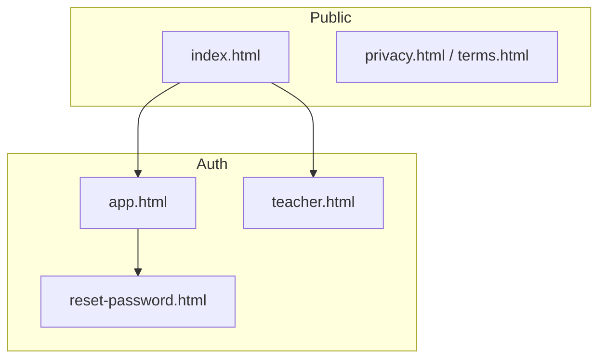

# Production Rollout Plan

**Last updated:** June 2025 — Phase 1 split for no-domain development.

## Decisions confirmed

| Decision | Choice |
|----------|--------|
| Pricing model | **Hybrid** — individual student subscriptions + school/class licenses |
| Free tier | **Freemium limited** — core practice works with caps; premium unlocks exam prep, analytics, flashcards |
| Product name | **TBD** — landing page uses generic "AQA GCSE Combined Science" copy until named |
| Domain / hosting | **Deferred** — develop locally (Live Server / `127.0.0.1:5500`) until name and domain are chosen |

---

## Current state

| Surface | File | Status |
|---------|------|--------|
| Student app | `index.html` → will become `app.html` | Full feature set built |
| Teacher portal | `teacher.html` | Class codes, roster, student drill-down |
| Developer admin | `admin.html` | Question authoring |

**Gap:** No landing page, no password reset UI, no feature gates, no Stripe, no deployment config.

---

## Target site architecture

---

## Phase 1 — split into 1A (deferred) and 1B (implement now)

### Phase 1A — Domain & hosting (deferred until product name chosen)

- [ ] Register domain
- [ ] Deploy to Cloudflare Pages (or Netlify) from GitHub
- [ ] Supabase → Authentication → URL Configuration:
  - Site URL: production origin
  - Redirect URLs: `/app.html`, `/reset-password.html`, `/teacher.html`
- [ ] Customise Supabase email templates (Confirm signup, Reset password)
- [ ] Optional: custom SMTP for deliverability

**Local dev workaround (use now):** In Supabase Dashboard → Authentication → URL Configuration, add redirect URLs for your dev origin, e.g.:

- `http://127.0.0.1:5500/reset-password.html`
- `http://localhost:5500/reset-password.html`

Password reset emails will work in local testing once these are listed.

### Phase 1B — Implement without a domain (ready to build)

#### 1. Split student app from landing page

| Action | Detail |
|--------|--------|
| Copy | `index.html` → `app.html` (student app shell) |
| Create | New `index.html` — marketing landing page |
| Create | `landing.css` — hero, features, pricing, FAQ layout |
| Update links | `teacher.html`, `admin.html`, `src/teacherPortal.js` → `app.html` instead of `index.html` |

**Landing page sections** (generic branding until product is named):

1. Nav — Features, Pricing, For Teachers, Log in → `app.html`, Get started → `app.html#signup`
2. Hero — "AQA GCSE Combined Science revision that adapts to you"
3. Features grid — SRS scheduling, exam-style papers, analytics, teacher visibility
4. How it works — Sign up → Onboarding → Daily practice → Track progress
5. Pricing preview — Free vs Premium table (matches freemium matrix below)
6. FAQ — FT/HT tiers, data privacy, teacher class codes
7. Footer — Privacy, Terms, placeholder contact

#### 2. Auth improvements on `app.html`

Replace single auth form with three panels toggled in JS:

| Panel | Contents |
|-------|----------|
| Sign in | Email, password, "Forgot password?", link to sign-up |
| Sign up | Name, email, password, **Terms/Privacy checkbox**, register button |
| Forgot password | Email only, "Send reset link" |

**`src/app.js` changes:**

- `setAuthPanel('signin' | 'signup' | 'forgot')` wired to new buttons
- Sign-up reads `#signupEmail`, `#signupPassword`; requires `#termsAccepted`
- `resetPasswordForEmail(email, { redirectTo: origin + '/reset-password.html' })`
- On load: if `location.hash === '#signup'` → show sign-up panel

#### 3. Password reset page

**New files:** `reset-password.html`, `src/resetPassword.js`

Flow:

1. User clicks link in email → lands on `reset-password.html#...` with recovery token
2. Supabase `onAuthStateChange` fires `PASSWORD_RECOVERY` → show new-password form
3. `updateUser({ password })` → redirect to `app.html` with success message

**Teacher portal:** Add "Forgot password?" on `teacher.html`; same reset page; after reset redirect to `teacher.html`.

#### 4. Legal pages

**New files:** `privacy.html`, `terms.html`

- Plain HTML, shared minimal legal stylesheet (or `landing.css`)
- UK GDPR-oriented privacy policy placeholder (data controller TBD, Supabase as processor, what is collected: email, attempts, SRS state)
- Terms of use placeholder (acceptable use, account responsibility, no guarantee of exam results)
- Linked from sign-up checkbox and landing footer

**Optional migration (later):** `profiles.terms_accepted_at timestamptz` — not required for Phase 1B if checkbox is client-only validation.

#### 5. Cross-link updates

| File | Change |
|------|--------|
| `teacher.html` | `index.html` → `app.html`; add forgot-password link |
| `src/teacherPortal.js` | Redirect students to `app.html` |
| `admin.html` | Redirect non-developers to `app.html` |
| `styles.css` | Comment: linked from `app.html` |

#### Phase 1B exit criteria

- [x] Visiting `/` shows landing page; `/app.html` is the student app
- [x] Sign-up requires Terms/Privacy acceptance
- [x] Forgot password sends email and reset flow completes locally (with Supabase redirect URLs configured)
- [x] Teacher portal links to student app correctly
- [x] Privacy and Terms pages accessible from footer and sign-up

---

## Free vs paid feature matrix (Phase 2+)

| Feature | Free | Premium |
|---------|------|---------|
| Account + onboarding | Yes | Yes |
| Start Practice | 15 questions/day | Unlimited |
| Heatmap | View only | Click to practise |
| Exam Prep | Locked | Full |
| Analytics tab | Summary only | Full |
| Flashcards | Locked | Full |
| Hints | 1 per question | All |
| Class join | Yes | Premium if class licensed |

---

## Phase 2 — Freemium gates

- Migration: `daily_usage`, Stripe columns on `profiles` / `classes`
- `src/featureAccess.js` + upgrade modal in `app.html`
- Wire gates in `app.js`; RPC `increment_daily_usage`

## Phase 3 — Stripe individual subscriptions

- Edge Functions: `create-checkout-session`, `stripe-webhook`
- Student Premium monthly/annual products

## Phase 4 — Class / school licenses

- Teacher "Upgrade class" UI
- Webhook grants Premium to enrolled students via `join_class_by_code`

## Phase 5 — Launch polish

- Live Stripe, pilot school, README ops runbook
- Revisit Phase 1A when product name and domain are ready

---

## Other features considered (recap)

| Feature | Status |
|---------|--------|
| Onboarding wizard | Done |
| SRS + adaptive practice | Done |
| Exam Prep + AQA paper builder | Done |
| XP + hints | Done |
| Physics calculation workflow | Done |
| Teacher portal + student drill-down | Done |
| Homework / assignments | Planned — `teacher_dashboard_enhancement_plan.md` |
| AI long-answer marking | Live — rate-limit free tier in Phase 2 |

---

## Implementation todos

| ID | Task | Status |
|----|------|--------|
| phase1-hosting | Domain + Cloudflare Pages + production Supabase URLs | **Deferred** |
| phase1-landing | Landing `index.html`, `app.html` split, cross-links | Done |
| phase1-auth | Reset password flow, Terms/Privacy, auth panel polish | Done |
| phase2-gates | Feature gates + usage RPC | Pending |
| phase3-stripe-student | Student Stripe Checkout | Pending |
| phase4-stripe-class | Class license billing | Pending |
| phase5-launch | Live mode + pilot | Pending |

---

## Note on execution

Phase 1B was requested for implementation but is blocked while the workspace remains in **plan mode** (only markdown edits allowed). Switch to **agent mode** and ask to "implement Phase 1B" to apply the file changes above. `app.html` copy from `index.html` is prepared and ready for the split.
