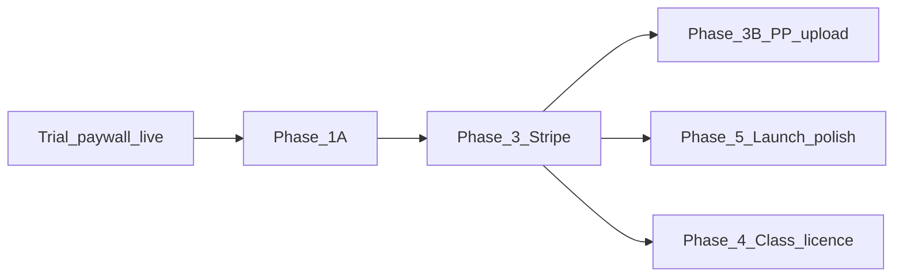

# Production Rollout Plan

**Last updated:** September 2026

## Executive summary

**Trial + hard paywall are implemented in app code** (14-day full access on student signup, then lock). Apply migration [`supabase/migrations/20260915123000_trial_hard_paywall.sql`](supabase/migrations/20260915123000_trial_hard_paywall.sql) (or the matching section in [`supabase/apply_in_sql_editor.sql`](supabase/apply_in_sql_editor.sql)) on your Supabase project before relying on it in production.

**Pre-public rollout** still requires Phase 1A (domain/hosting), Stripe checkout (Phase 3), legal/compliance polish (Phase 5), and PP bulk-upload admin (Phase 3B). Class licence billing stays **Phase 4**.

Admin **Pilot Pro Access** remains the payment bypass until Stripe is live.

---

## Decisions confirmed

| Decision | Choice |
| -------- | ------ |
| **Pricing model** | **Paid subscription with 14-day free trial** — not permanent freemium |
| **Trial behaviour** | Full access during 14 days; **hard paywall** after trial if no payment / admin grant |
| **Individual pricing** | **£15/year** early adopters · **£20/year** standard (annual only at launch) |
| **School PP access** | Schools email PP student list → **developer admin bulk upload** → comped access (no charge) |
| **Class licence** | **Retained** — teacher/school pays → enrolled students get access (Phase 4) |
| **Product name** | **TBD** (blocks Stripe branding + legal pages) |
| **Domain / hosting** | Deferred → **Phase 1A** |
| **Analytics DB offload** | **Deferred** — client-side aggregation acceptable at pilot scale |

---

## Access model (live in code)

```
hasAccess =
  developer
  OR subscription_tier = 'paid'   -- admin Pilot Pro / future Stripe
  OR class_licence active
  OR trial_ends_at > now()        -- 14-day full access
```

| User type | Access |
| --------- | ------ |
| New signup | **14-day trial** — full features |
| After trial, no payment | **Locked** — subscribe CTA only (no degraded free tier) |
| Paid / admin-granted | Full access — £15/yr (early) or £20/yr when Stripe live |
| PP student (admin upload) | Full access — free, no Stripe (Phase 3B bulk; Pilot tab works now) |
| Class licence student | Full access via school (Phase 4) |
| Pilot / manual | Admin Pilot Pro tab |

**Implemented:** [`src/featureAccess.js`](src/featureAccess.js), [`src/app.js`](src/app.js) hard paywall, [`supabase/migrations/20260915123000_trial_hard_paywall.sql`](supabase/migrations/20260915123000_trial_hard_paywall.sql).

**Still Phase 3:** Stripe Checkout / webhooks; upgrade button remains “coming soon”.

---

## Phase status


```mermaid
flowchart LR
  trialLive[Trial_paywall_live] --> p1a[Phase_1A]
  p1a --> p3[Phase_3_Stripe]
  p3 --> p3b[Phase_3B_PP_upload]
  p3 --> p5[Phase_5_Launch_polish]
  p3 --> p4[Phase_4_Class_licence]
```

| Phase | Scope | Status |
| ----- | ----- | ------ |
| **1B** | Landing, `app.html` split, password reset, Terms/Privacy shells | **Done** |
| **Perf** | Tier 1+2 dashboard deferral, lazy modules | **Done** |
| **2→trial** | 14-day trial + hard paywall (replaces freemium) | **Done in code** — apply SQL migration on Supabase |
| **1A** | Product name, domain, Cloudflare Pages, prod Supabase redirect URLs, env-based config | **Blocked** — prerequisite for public launch |
| **3** | Stripe annual sub, webhooks, live Checkout from upgrade modal | **Blocked** — after 1A |
| **3B** | Admin PP bulk email upload → comped access | **New** — before school rollout |
| **4** | Class licence Stripe billing | **Pending** |
| **5** | Launch polish (legal finalisation, school trust assets) | **Pending** |

---

## Pre-rollout checklist (ordered)

### Phase 1A — Infrastructure (blocker)

- Choose product name and register domain
- Deploy static site to Cloudflare Pages (or equivalent)
- Move hardcoded Supabase URL/key from [`src/dbClient.js`](src/dbClient.js) to build-time or runtime env
- Configure Supabase Auth redirect URLs for production domain (`app.html`, `reset-password.html`, teacher portal)
- Optional but recommended: Vite MPA build for cache-busting and env injection

### Phase 3 — Stripe individual subscription (blocker for paid launch)

- Stripe Products/Prices: annual £15 (early-adopter coupon or separate Price ID) and £20 standard
- Checkout Session (align Stripe trial with app `trial_ends_at` / or rely on app trial already granted)
- Supabase Edge Function(s): `create-checkout-session`, `stripe-webhook`
- Webhook handlers → update `profiles.stripe_customer_id`, `stripe_subscription_id`, `subscription_status`, `subscription_tier`
- Replace upgrade modal “coming soon” with live Checkout redirect ([`app.html`](app.html) `#upgradeModal`)
- Customer portal link for manage/cancel subscription
- Update [`terms.html`](terms.html) and [`privacy.html`](privacy.html): legal entity, trial auto-renewal, cancellation, Stripe as processor, PP school data handling

### Phase 3B — PP comp access (before school pilots)

- New table e.g. `pp_access_grants` + RLS (developer-only write)
- Admin tab: CSV/text paste upload of emails (extend [`admin.html`](admin.html) alongside existing Pilot Pro tab)
- RPC `bulk_grant_pp_access(emails[])` — match emails, set `subscription_tier = 'paid'` with `subscription_status = 'comped'`

### Phase 4 — Class licence (post-individual launch)

- Stripe Checkout for school/class (existing `classes.is_paid`, `paid_until` columns)
- `join_class_by_code` already grants Pro when class is paid — wire to Stripe webhook

### Phase 5 — Launch polish

- Finalise legal entity + contact email in Terms/Privacy
- "Not affiliated with AQA" disclaimer (partially present)
- "How marking works" trust page
- 2–3 pilot school quotes
- School DPA template for GDPR compliance
- Supabase production hardening review (RLS advisors)

---

## Next step

1. **Apply** [`20260915123000_trial_hard_paywall.sql`](supabase/migrations/20260915123000_trial_hard_paywall.sql) on Supabase.
2. **Smoke-test:** new signup → trial badge + mastery map practice; expire `trial_ends_at` → hard paywall; Pilot Pro → full access.
3. **When ready to launch:** Phase 1A → Phase 3 (Stripe Checkout) → Phase 3B → Phase 5 → public launch → Phase 4 class billing.
